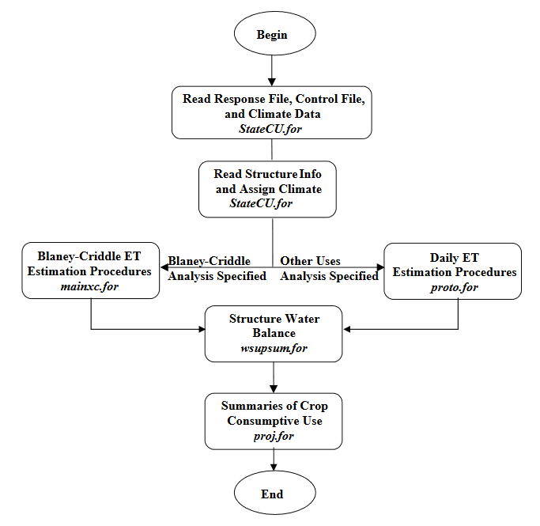
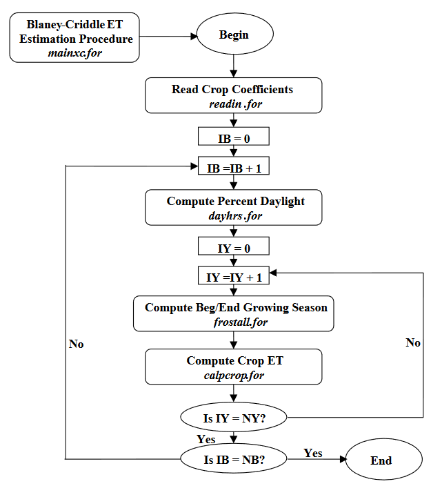
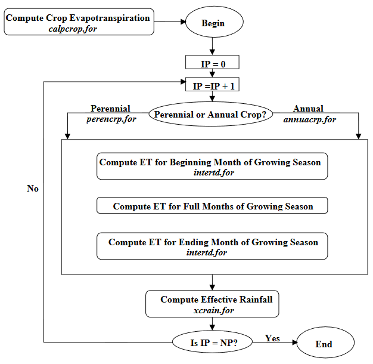
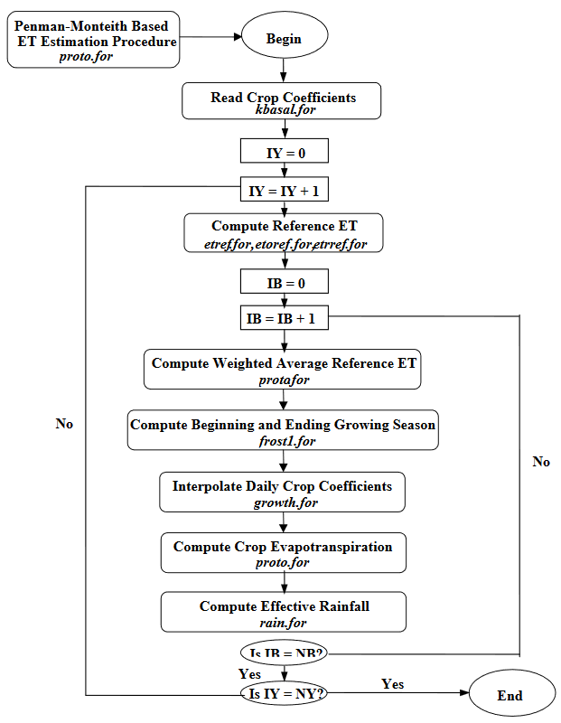
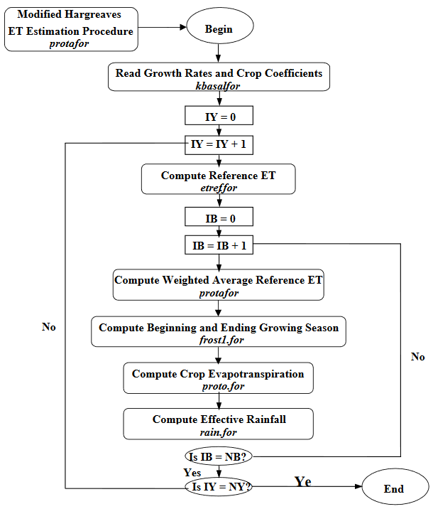
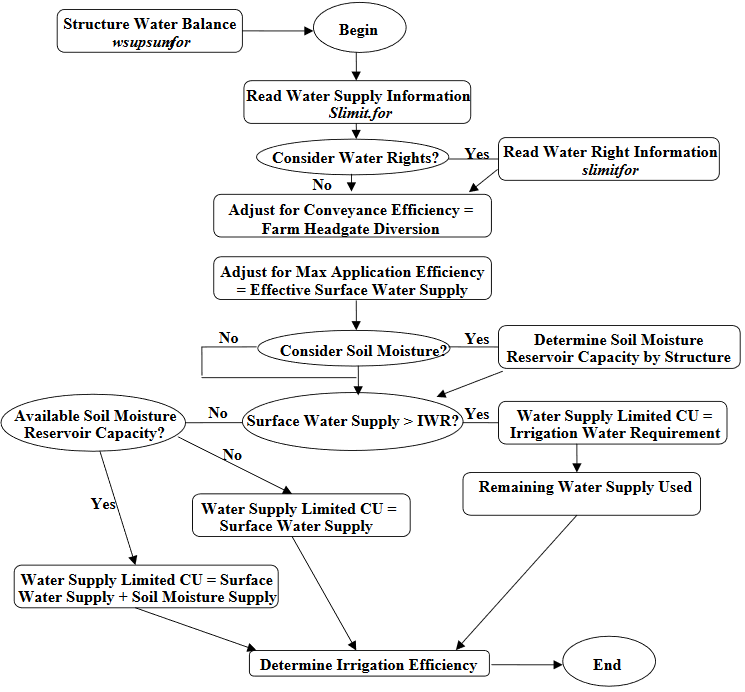
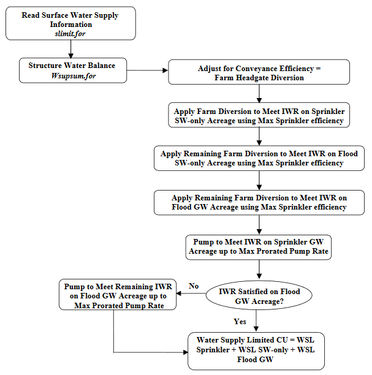
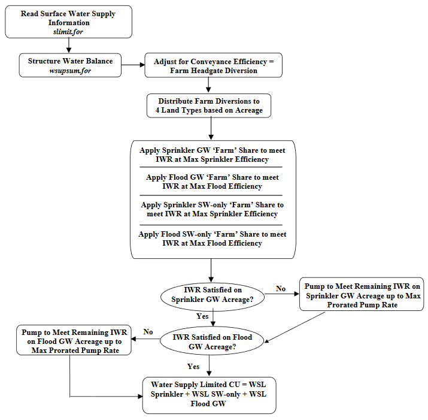
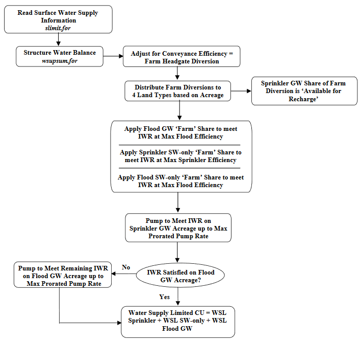

This section contains flowcharts showing the logical flow of the StateCU FORTRAN program.  The flowcharts include the main body of the StateCU program; 
the Blaney-Criddle calculation; the Blaney-Criddle crop evapotranspiration calculation; the Penman-Monteith Calculation; the ASCE Standardized Penman-Monteith 
calculation; the Modified Hargreaves Calculation; the structure water balance; the structure water balance with ground water supplies; and other (non-irrigation) 
consumptive uses procedure.  StateCU subroutines are indicated in italics.

**

Figure B-1 - Main Body of StateCU Program (<a href="figureb1.PNG">see also the full-size image</a>)

**

**

Figure B-2 - Blaney-Criddle Calculation (<a href="figureb2.PNG">see also the full-size image</a>)

**

where \\(NB\\) = Total number of structures in scenario  
\\(NY\\) = Total number of years in simulation

**

Figure B-3 - Crop Evapotranspiration with Blaney-Criddle (<a href="figureb3.PNG">see also the full-size image</a>)

**

where \\(NP\\) = Total number of crop types for the current structure

**

Figure B-4 - Penman-Monteith and Standardized Penman-Monteith Calculation (<a href="figureb4.PNG">see also the full-size image</a>)

**

where \\(NB\\) = Total number of structures in scenario  
\\(NY\\) = Total number of years in simulation

**

Figure B-5 - Modified Hargreaves Calculation (<a href="figureb5.PNG">see also the full-size image</a>)

**

where \\(NB\\) = Total number of structures in scenario  
\\(NY\\) = Total number of years in simulation

**

Figure B-6 - Structure Water Balance Procedure Surface Water Only (<a href="figureb6.PNG">see also the full-size image</a>)

**

Procedure is performed for each structure in scenario for every simulation year.  If presimulation for soil moisture initialization is selected 
then above logic is executed in a presimulation mode prior to simulation for results.  If water rights are considered, diversions to CU and soil 
moisture reservoir and diversion from soil moisture reservoir are accounted for by water rights. Water supply read from the drain file is considered 
‘other’ water, along with water diverted in excess of water rights under free river conditions. If water rights are considered and the ‘priority’ 
option for soil moisture is turned on, then senior priority water available for soil moisture is allowed to displace junior priority water in the 
soil reservoir and senior priority soil moisture is withdrawn and used prior to junior priority soil moisture.

**

Figure B-7 - Structure Water Balance Procedure Ground Water Available gmode = 1 - Maximize Supply Approach (<a href="figureb7.PNG">see also the full-size image</a>)

**

Acreage under each structure is divided into four categories, as shown in the flow chart. **Sprinkler GW Acreage** is sprinkler irrigated acreage 
identified as having a ground water source.  **Flood GW Acreage** is flood irrigated acreage identified as having a ground water source.  **Sprinkler 
SW-only Acreage** is sprinkler irrigated acreage without a ground water source. **Flood SW-only Acreage** is flood irrigated acreage without a ground 
water source.  Soil moisture accounting is performed as shown in [Figure B-6](#figureb6) for acreage receiving surface water.  Maximum pumping rate is area-prorated 
between Sprinkler GW and Flood GW acreage. Procedure is performed for each structure in scenario for every simulation year.

**

Figure B-8 - Structure Water Balance Procedure Ground Water Available gmode = 2 - Mutual Ditch Approach (<a href="figureb8.PNG">see also the full-size image</a>)

**

Acreage under each structure is divided into three categories, as shown in the flow chart. **Sprinkler GW Acreage** is sprinkler irrigated acreage 
identified as having a ground water source.  **Flood GW Acreage** is flood irrigated acreage identified as having a ground water source. **Sprinkler 
SW-only Acreage** is sprinkler irrigated acreage without a ground water source.  **Flood SW only Acreage** is flood irrigated acreage without a ground 
water source. Soil moisture accounting is performed as shown in [Figure B-6](#figureb6) for acreage receiving surface water. Maximum pumping rate is area-prorated 
between Sprinkler GW and Flood GW acreage.  Procedure is performed for each structure in scenario for every simulation year. 

**

Figure B-9 - Structure Water Balance Procedure Ground Water Available gmode = 3 - Mutual Ditch Approach with Ground Water Pumped to Meet Sprinkler Acreage Irrigation Water Requirements (<a href="figureb9.PNG">see also the full-size image</a>)

**

Acreage under each structure is divided into three categories, as shown in the flow chart. **Sprinkler GW Acreage** is sprinkler irrigated acreage identified 
as having a ground water source.  **Flood GW Acreage** is flood irrigated acreage identified as having a ground water source.  **Sprinkler SW-only Acreage** is 
sprinkler irrigated acreage without a ground water source. **Flood SW-only Acreage** is flood irrigated acreage without a ground water source.  Soil moisture 
accounting is performed as shown in [Figure B-6](#figureb6) for acreage receiving surface water. Maximum pumping rate is area-prorated between Sprinkler GW and Flood GW 
acreage.  Procedure is performed for each structure in scenario for every simulation year. 

