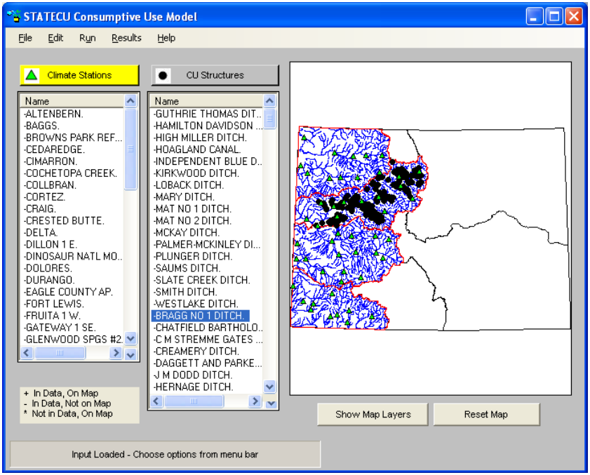

When GIS files are available to a scenario, the main interface window for the StateCU GUI has several
components, as described below. The example shown in [Figure 1](#figure1) below is for a Structure Scenario. The main
interface window is similar for a Climate Station Scenario except that the CU Structures list is not provided. 

**

Figure 1 - StateCU Main Interface (<a href="../figure1.PNG">see also the full-size image</a>)

**

| Interface Component | Description |
| ------------ | ------------- |
| Menu Bar | The menu bar at the top of the interface contains the menus for each of the major windows available within the interface. Each menu is discussed in detail in the following sections. |
| Map Display | When the application is first opened, the Map Display contains the CDSS splashscreen. When GIS files are available to a scenario and the dataset is loaded, the map displays the available graphics overlays which may include climate station locations, CU structure locations, water district boundaries, and basin hydrology. The Show Map Layers button activates a new window displaying map layers and allows the user to toggle map layers on and off. Use the LEFT mouse button to draw a box to zoom in on the map and use RIGHT mouse button selects stations or structures. The Reset Map button re-displays the full size map. |
| Climate Stations / CU Structures | Upon loading a Crop Consumptive Use dataset that includes GIS files, the user can choose an individual climate station or CU structure directly from the map using the RIGHT mouse button, or by selecting the station or structure name from the lists on the bottom of the main interface window. The lists (climate stations or CU structures) identify which stations and structures are included in the loaded dataset and/or shown on the map. While both lists are shown for a Structure Scenario, only the climate stations are shown for a Climate Station Scenario. |
| Status Messages | Instructions are displayed in the status message area, located on the bottom of the main interface window. This area also displays a status bar showing the input data loading progress. |