The __Edit__ menu displays the major categories of StateCU input data that can be viewed and edited. All of
the menu commands shown in [Figure 19](#figure19) are active for a simulation of crop consumptive use under a
_Structure Scenario_, as described below. With a _Climate Station Scenario_, the Structure Information
command under the __Edit__ menu is not visible and the information shown under the Model Control Options
and Climate Station Information windows is limited. 

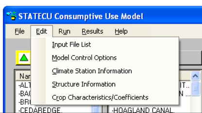
**

Figure 19 - Edit Menu (<a href="../figure19.PNG">see also the full-size image</a>)

**

Several input data files available under the Edit Menu allow the user to view and edit input data, including
climate data, crop acreage, diversion records, and irrigation efficiencies. The ‘rules’ for editing input data
through the GUI are similar for each data type, therefore the editing rules will be described in this section
and referenced in the following sections when each data type is discussed individually. 

The user has the ability to edit the input data through specific GUI windows, accessed through the main GUI
__Edit Menu__. In all cases, input data can be edited for the existing time period provided in the scenario,
however the user can not extend the time period of data. Input data through the GUI is provided in grid
format, similar to an Excel spreadsheet. To edit an individual data value, select a cell, type-over the original
data value and press ENTER, TAB or select a different cell to ‘commit’ the changed data value. Changed
data values that are not ‘committed’ are not available to be saved when the save option is selected. Press
ESC prior to committing a data value to retrieve the original data value. 

There are commands available under each input data GUI window __Edit__ menu to help the user edit the data,
including __Copy__, __Paste__ and __Select All__. The user can also click on a data cell with the RIGHT mouse button
to access __Copy__, __Paste__ and __Adjust Values__ options. The __Adjust Values__ options include __Scale__, in which the
data value can be scaled up or down by a user-input value, or __Add__, in which the user inputs a value to be
added (negative values are allowed) to the selected data value. Note that each data input type has allowable
values, designed to provide minimal error checking and prevent the user from inputting unreasonable data.
For example, diversion data must be between 0 and 100,000 and crop acreage data must be between 0 and
200,000. If the user provides a scale or addition factor that creates unreasonable data, the GUI will provide
an error message indicating the scale or add operation was not successful and the allowable values for that
specific data type. 

Data can be copied and pasted into and out of the GUI window from an external spreadsheet or database
application. Data can also be copied from one area of the GUI window to another area. Note that only
allowable values can be pasted into the GUI window. Similar to the scale and add factor checking,
minimum error checking will take place on the copied value(s) and the GUI will provide an error message
indicating that the pasting operation was not successful and the allowable values for that specific data type.
There are four possible configurations for pasting data into a GUI window; the GUI pastes each
configuration in a similar fashion as Excel. The following list discusses the configurations and how the GUI
handles each pasting operation:

* Copy one cell from the original source and paste one cell into the GUI window: The copied single
data value will replace the GUI data value.
* Copy one cell from the original source and paste a range of cells into the GUI window: The copied
single data value will replace all of the data values in the selected range in the GUI.
* Copy a range of cells from the original source and paste to one selected cell into the GUI window:
The copied range of data values will replace the same number data values in the GUI, using the
single cell selected as the upper left cell of the copied range. If the range to be pasted extends into
read-only columns or rows (e.g. cells containing years, annual totals, etc.), then the pasted data will
be truncated at that row and column. Note that if any of the copied data values are non-allowable,
then none of the cells will be pasted.
* Copy a range of cells from the original source and paste to a selected range of cells into the GUI
window: The range of copied cells must be the same size and shape as the pasted range, or the GUI
will not allow any data to be pasted. The copied range of data values will replace the pasted range
of data values in the GUI. If the range to be pasted extends into read-only columns or rows (e.g.
cells containing years, annual totals, etc.), then the pasted data will be truncated at that row and
column. Note that if any of the copied data values are non-allowable, then none of the cells will be
pasted. 

Data read into the GUI from the input files is also minimally error-checked based on the allowable values.
If data in the input files does not meet the allowable values, the data will be color-coded and the user will
have to correct any non-allowable data prior to saving any data through the GUI window. 

Data in the GUI windows can be viewed graphically, select the __Graph__ command under the __View__ menu of
each GUI window. This command activates and utilizes an Excel spreadsheet to format and graph the data.
If Excel is not available, then the GUI provides an error message when the __Graph__ option is selected from
the __View__ menu. The StateCU GUI opens Excel in a separate window and the time series data are provided
under a worksheet labeled __Data__ (monthly data) or __Raw Data__ (daily data). A graph displaying the data is
provided under a separate worksheet labeled __Graph__. For daily data, the graph is a subset of the available
period, for ease of viewing; the user can change the period through Excel. The user can manipulate the
graph and data and save the spreadsheet independent of the StateCU analysis. Note that changes to the data
in the Excel spreadsheet will not be reflected in the original input data file, unless the user copies the data
back into the GUI window and saves that data. Note that variations to the editing rules in this general
discussion will be discussed in the following sections under each data type. 

##2.5.1 - Input File List##

The __Input File List__ command allows the user to view and edit individual input files listed in the response
file of a scenario. When the __Input File List__ command is selected from the __Edit__ menu, the __View/Edit__
__Scenario File (RCU)__ window [(Figure 20)](#figure20) is activated. The user can then double click on a file name,
prompting an __Open File__ window, in which the user can choose individual files located on any available disk
drive or directory. Note that any input files listed in the original response file that do not exist are not listed
in the __View/Edit Scenario File (RCU)__ window and will not be saved in the new response file. The __Copy__
option under the __Edit__ menu allows the user to copy the input file names and paste the list in an external
application, such as a text editor or spreadsheet. Utilize the __Edit…Select All__ option or individually select or
deselect input file names to copy by holding down the CTRL key while selecting file names with the LEFT
mouse button. 

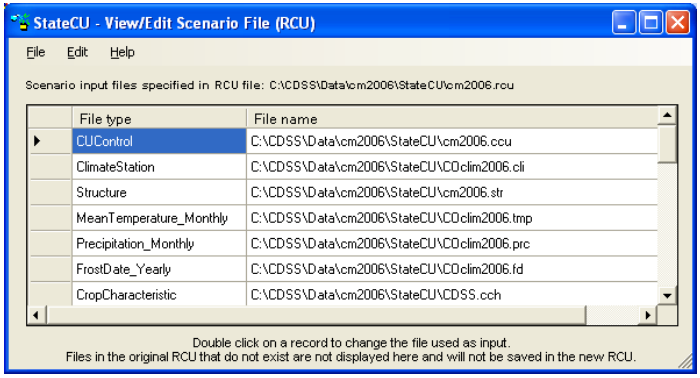
**

Figure 20 - Input File List Window (<a href="../figure20.PNG">see also the full-size image</a>)

**

To save changes to the Input File List, select __Save__ from the __File__ menu. This command saves changes over
the active response file. The __Save As…__ command allows the response file to be saved in a different
location or to a different name. The name of the active response file displayed in the __View/Edit Scenario 
File (RCU)__ window can be determined by selecting the __Input File Info__ command under the __Help__ menu
[(Figure 21)](#figure21). 

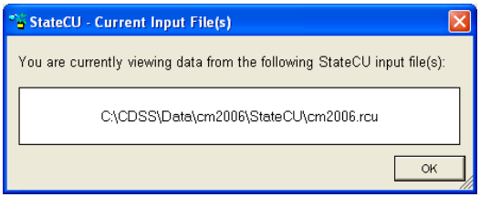
**

Figure 21 - Input File Information Window (<a href="../figure21.PNG">see also the full-size image</a>)

**

A File menu and Help menu similar to those shown above are provided for each command under the Edit
menu. 

##2.5.2 - Model Control Options##

The __Model Control Options__ window displays the information and parameters that control a StateCU
execution. With a _Structure Scenario_, the information is organized by three data groups which appear as
‘folder tabs’: __General, Analysis Options__, and __More Options__. The information available under each data
group is viewed by clicking the folder tabs. Only the information shown under the General tab and a limited
set of options under the Analysis Options tabs are provided for a _Climate Station Scenario_. The following
should be noted when editing the model control parameters: 

__General__ [(Figure 22)](#figure22):

* __Simulation Description__ – Three lines are available to describe the simulation.
* __Selected Analysis Period__ – Must be a subset of the __Available Record__ (which is the first and last year
of data that is available in every input file containing time series data).

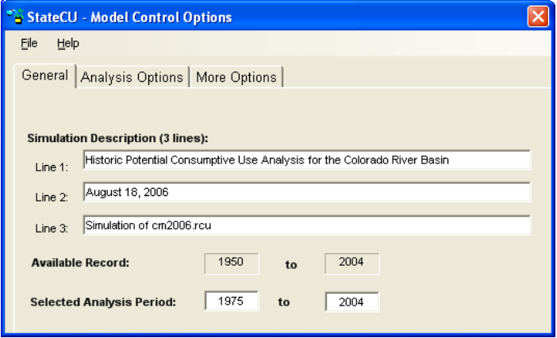
**

Figure 22 - Model Control Options - General (<a href="../figure22.PNG">see also the full-size image</a>)

**

__Analysis Options__ [(Figure 23)](#figure23):

* __CU Method Time Step__ – This option indicates whether the scenario uses a monthly consumptive use
method (i.e. Original Blaney-Criddle, Modified Blaney-Criddle, or Pochop) or a daily method (i.e.
ASCE Penman-Monteith). Daily climate data files must be included in the response file for the daily
option to be activated.
* __Effective Precipitation Methods__ – This option displays the effective precipitation methods that are
available for the scenario. If the effective precipitation method is turned off (e.g. ‘None’), then StateCU
estimates the total potential crop consumptive use. The effective precipitation methods available under
a monthly consumptive use analysis include the SCS TR-21 method and the USBR method, as described
in [Section 3.1.2](../ModelDescription/31.md). Under a daily consumptive use analysis, the user can apply either a monthly or
daily effective precipitation method. The daily effective precipitation methods include maximum
effective inches per day, a fraction of the daily precipitation that is effective, or the SCS NEH4 method,
as described in [Section 3.1.6](../ModelDescription/31.md). 

The following Analysis Options are only available under a _Structure Scenario_:

* __Water Supply__ – This option should be selected to calculate water supply-limited crop consumptive use.
Water supply information must be available for the Selected Analysis Period.
* __Water Rights__ – This option should be selected to group consumptive use as senior or junior to a usersupplied administration number(s). This option is only available if the Water Supply option is selected
and a direct diversion rights file (*.ddr) is included in the scenario. The administration processing
method and numbers can be viewed and edited by selecting the __View/Edit Administration Processing
Method__ command button as described in [Section 2.5.2.1](#2521-viewedit-administration-processing-method-and-daily-diversion-data).
* __Ground Water__ – This option should be selected to consider ground water supply (not available if Water
Rights option is selected).
* __Soil Moisture__ – This option should be selected to consider water stored in the soil moisture zone as a
water supply for serving crop consumptive use (only available if the Water Supply option is selected).
Soil Moisture variables are described in [Section 2.5.2.4](#2524-viewedit-soil-moisture-variables).
* __Drain/Tailwater__ – This option should be selected if the scenario includes a drain file (*.dra) that
contains supplemental tailwater, drain flows or other off-river supplies not included in diversion records.
If the drain file contains negative values, indicating non-irrigation diversions in the diversion file that
need to be offset, select the ‘Yes – allow neg values’ drain option. See [Section 4.28](../InputDescription/428.md) for more
information on drain file usage. 

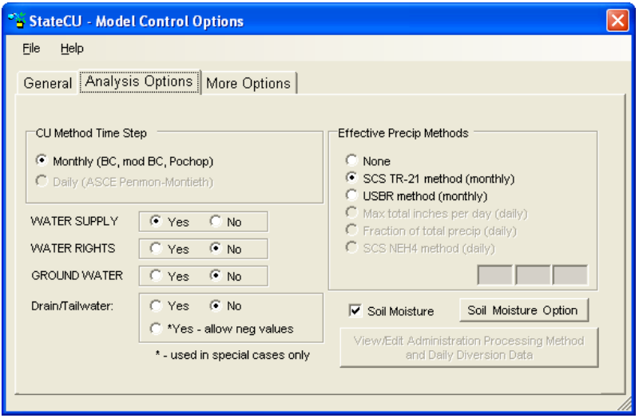
**

Figure 23 - Model Control Options - Analysis Options (<a href="../figure23.PNG">see also the full-size image</a>)

**

__More Options__ [(Figure 24)](#figure24):

* __Summary of Input Data__ – This option allows a Basic or Detailed summary of all input used in the
model (*.sum).
* __Missing Data Fill Options__ – This option allows missing climate and diversion data to be filled ‘on-thefly’ to provide for a more complete consumptive use analysis. Utilizing one of these options allows
StateCU to fill missing climate and/or diversion data within the consumptive use simulation, however
does not replace missing data in the input file. The user can choose the following filling options:
	* No time series data filling
	* To fill missing diversion records based on average shortages and no filling of climate data
	* To fill missing diversion records with zeros and no filling of climate data
	* To fill both missing climate and diversion data with historic monthly averages
	* To fill missing climate data with historic monthly averages and diversions with zeros
	* To fill missing climate data with historic monthly averages and leave diversion data missing.
Note that other options for filling missing climate and diversion data in input files are available through
the TSTool DMI. Missing records can also be filled by editing or copying data through the GUI.
* __Model Output Data Options__ – This option allows several levels of output data to be generated. Option
1 provides a matrix formatted crop irrigation water requirement summary (*.cir) and water supply
limited consumptive use summary (*.wsl) when water supply is considered. Option 2 provides the
output from Option 1 plus a summary water budget (*.swb). Option 3 provides the output from Option
2 plus a detailed ‘by structure’ water budget (*.dwb). In addition to the output generated by Options 1
through 3, the user can also choose to create a detailed water budget report by land category for a single
structure (*.4wb), selected from a pull down list.
* __StateMod Formatted file of Irrigation Water Requirement__ – This option creates an output file of
irrigation water requirement (*.ddc) in the standard StateMod format.

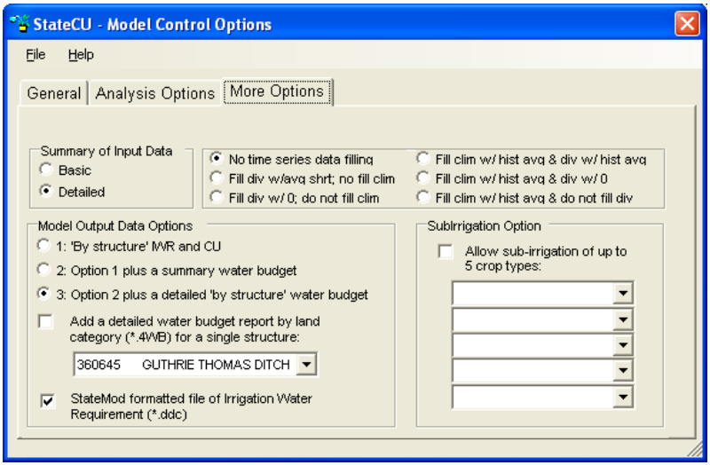
**

Figure 24 - Model Control Options - More Options (<a href="../figure24.PNG">see also the full-size image</a>)

**

When the __Save__ or __Save As…__ command is selected from the File menu, the user will be prompted for a new
control (*.ccu) file name and the associated response file name. The new control file name will be written to
the response (*.rcu) file. Changes made under any of the tabs will be saved. 

###2.5.2.1 - View/Edit Administration Processing Method and Daily Diversion Data###

The __View/Edit Administration Processing Method and Daily Diversion Data__ command button on the
__Analysis Options__ tab in the __Model Control Options__ window activates the __Diversion/Administration
Processing__ window [(Figure 25)](#figure25). This window displays the information and parameters that control the
determination of senior or junior diversions in a StateCU execution and the associated crop consumptive use
characterized by priority (only available for a __Structure Scenario__). 

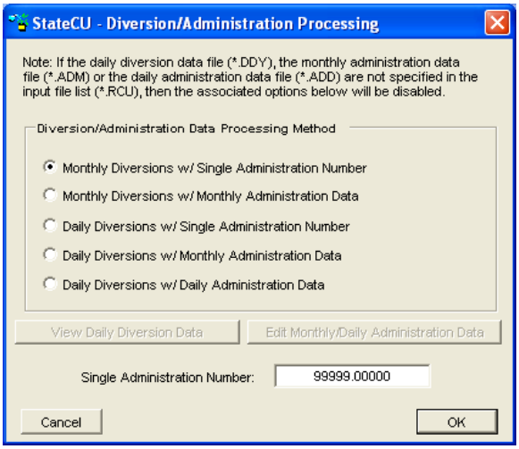
**

Figure 25 - Diversions/Administration Processing Window (<a href="../figure25.PNG">see also the full-size image</a>)

**

If water rights are being considered in the analysis (see [Section 2.5.2](#252-model-control-options)), the user can select an option that will
be used to ‘color’ the water supplies by user-defined administration number(s). The user can use daily or
monthly diversion data, and apply daily, monthly, or a single administration number to those diversions.
The available options are: 

1. Monthly diversion records and a single administration number.
2. Monthly diversion records and monthly administration data.
3. Daily diversion records and a single administration number.
4. Daily diversion records and monthly administration data.
5. Daily diversion records and daily administration data. 

The first two options are available if a monthly historical direct diversion data file (\*.ddh) is specified in the
simulation input file list. The last three options are available if a daily water supply data file (\*.ddy) is
specified in the simulation input file list. User input monthly (second and fourth options) and daily (fifth
option) administration numbers are stored in \*.adm and \*.add files, respectively, and are required to be on a
calendar year basis. A single administration value (first and third options) is stored in the model control
options file (\*.ccu) with other model control parameters. See [Section 2.5.1](#251-input-file-list) for discussion on how to add
these files to the simulation input list. See [Section 4](../InputDescription/41.md) for the format of these administration and diversion data
files. If a daily diversion file is used to process water rights, daily diversions must add up to the total
monthly diversions in the historical diversion data file (\*.ddh). 

To edit a single administration number, select either the first or third option and enter values in the __Single
Administration Number__ box. The user can view and edit diversion data and monthly or daily
administration numbers (see [Section 2.5](../GUI/25.md)). 

To save changes to the processing method and, if option 1 or option 3 are selected, changes to the single
administration number, select the __OK__ command button and then select the __Save__ or __Save As…__ command
from the __File__ menu on the __Model Control Parameters__ window. The save reloads the simulation input data
files. 

###2.5.2.2 - View Daily Diversion Data Window###

Selecting the __View Daily Diversion Data__ command button on the __Diversions/Administration Processing__
window activates the __View/Edit Historical Daily Diversion Data__ window [(Figure 26)](#figure26). This option is only
available if a daily diversion file has been defined in the simulation input file list and a one of the daily
diversion processing methods is selected on the __Diversion/Administration Processing__ window. The user
may select a structure to be viewed from the list of structures on the left side of the window; the diversion
data will automatically refresh when a structure is selected. Daily diversion data can not be negative. Daily
diversion data has units of cubic feet per second (cfs), with monthly totals in acre-feet. 

The user has the ability to edit the diversion data through this window. See [Section 2.5](../GUI/25.md) for more
information on how to edit data. To save changes to the daily diversion data for all structures, select the
__Save__ or __Save As…__ command from the __View/Edit Historical Daily Diversion Data…File__ menu. 

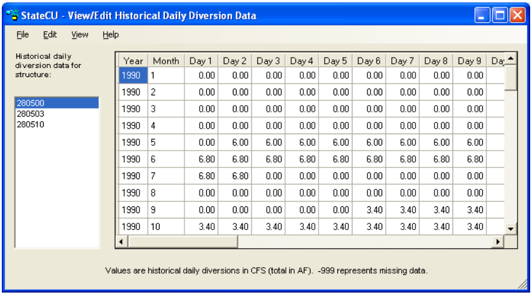
**

Figure 26 - View Daily Diversion Data Window (<a href="../figure26.PNG">see also the full-size image</a>)

**

###2.5.2.3 - Edit Monthly/Daily Administration Data###

Selecting the __Edit Monthly/Daily Administration Data__ command button on the
__Diversions/Administration Processing__ window activates the __View/Edit Administration Data__ window
[(Figure 27)](#figure27). This option is only available if a monthly or daily administration file has been defined in the
simulation input file list and one of the monthly or daily administration data processing methods is selected
on the __Diversion/Administration Processing__ window. 

The user has the ability to edit the administration data through this window. See [Section 2.5](../GUI/25.md) for general
information on how to edit data, however note that Scale and Add functions are disabled for this data type.
Administration data must be a number between 0 and 99999. Changes to the administration data, select the
__Save__ or __Save As…__ command from the __View/Edit Historical Administration Data…File__ menu. The user
will be prompted for a new monthly (\*.adm) or daily (\*.add) administration data file name and associated
response file name. The administration data file name is written to the response (\*.rcu) file. 

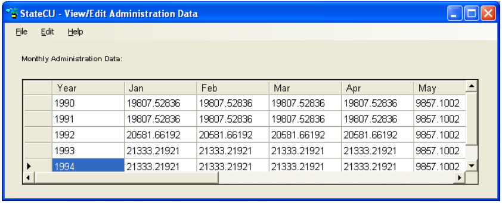
**

Figure 27 - View/Edit Administration Data Window (<a href="../figure27.PNG">see also the full-size image</a>)

**

###2.5.2.4 - View/Edit Soil Moisture Variables###

The __Soil Moisture Option__ button (only available for a _Structure Scenario_) on the __Model Control Options__
window activates the __Soil Moisture Variables__ window ([Figure 28](#figure28)) which displays the information and
parameters that control modeling of soil moisture in a StateCU execution. 

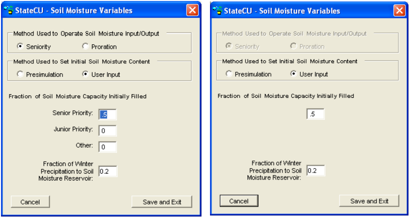
**

Figure 28 -  Soil Moisture Variables Window (with and without Water Rights) (<a href="../figure28.PNG">see also the full-size image</a>)

**

If the __Water Rights__ option under the __Model Control Options__ window is selected (see [Section 2.5.2](#252-model-control-options)), the
user can select an option in this window to operate the soil moisture reservoir on a ‘senior priority water
first’ basis. If the __Seniority__ option is selected, then any senior priority water available to the soil moisture
reservoir is allowed to displace junior priority water existing in the reservoir. This option also allows the
senior priority water in the soil moisture reservoir to be used (withdrawn) prior to the use of junior priority
water. The effect of this __Seniority__ option is to potentially increase the amount of consumptive use assigned
to the senior priorities. If water rights are not being considered or the __Seniority__ option is not selected, then
the soil moisture reservoir will be operated on a ‘prorated’ basis. In __Proration__ operation, soil moisture will
be filled with the first available water and there will be no displacement of water already in storage. If
considering water rights, soil moisture will be used under __Proration__ operations based on the proportion of
soil moisture in the various accounts. For example, if 10 acre-feet was withdrawn from a soil moisture
reservoir where the senior priority soil moisture comprised 30 percent of the soil moisture and the junior
priority soil moisture was 70 percent, then 3 acre-feet would be considered senior priority water and 7 acrefeet would be considered junior priority water.

The user can also select an option to allow initial soil moisture to be either set based on a __Presimulation__ (of
the same number of years as the true simulation) or by __User Input__ values. The __Presimulation__ mode starts
out with soil moisture contents at zero and through a consumptive use simulation, allows the ending soil
moisture values on a structure-by-structure basis to be assigned as the initial soil moisture values for the
simulation. If __User Input__ values are used, the user-defined percentages should add up to the percentage of
total soil moisture estimated to be full at the start of the simulation. If considering water rights, the user is
given an option of setting the percentages of the soil moisture capacity filled with __Senior Priority__ (to the
user-defined administration number) water, __Junior Priority__ water, or __Other__ (water not assigned to a
priority). The user-defined values are applied in a consumptive use simulation to each structure being
analyzed, regardless of that structure’s mix of junior and senior water rights.

The user can also choose to consider __Winter Precipitation to Soil Moisture__ by entering the percentage of
winter precipitation to be attributed to the soil moisture. The default is 20 percent, indicating a maximum of
20 percent of winter precipitation will be stored in soil moisture depending on available soil reservoir
capacity. See [Section 3.1.2.2](../ModelDescription/31.md) for details regarding the use of winter precipitation. To save changes, select
the __Save and Exit__ command button and then select the __Save__ or __Save As…__ command from the __Model
Control Parameters__ window. The save reloads the simulation input data files.

##2.5.3 - Climate Station Information##

The __Climate Station Information__ window allows the user to view and edit location information and
climate data for a selected climate station. An example is shown in [Figure 29](#figure29) for a _Climate Station
Scenario_. The __Climate Station Information__ window is similar under both scenarios except for the
following differences under a _Structure Scenario_:

* A field location can not be added. This option is only available under a _Climate Station
Scenario_ and allows the user to apply weighted climate station data and an orographic
adjustment to climate station data (see [Section 3.1.7](../ModelDescription/31.md)).
* Climate station assignments and the crop types and acreages are associated with the actual
structure and therefore viewed through the __Structure Information__ window. 

Each climate station is identified by its name, station ID, and a column indicating whether the climate
station is included in the current scenario (see the __Help…About Climate Stations__ menu for more
information). To view and edit the climate station location information, select a climate station from the list
and then view or edit the __Location1__ (e.g. county), __Location2__ (e.g. USGS Hydrologic Unit Code), __Latitude__,
and __Elevation__ data directly from the __Climate Station Information__ window. With a daily consumptive use
method, the __Temperature Instrument Height__ and __Wind Instrument Height__ can also be edited (entered in
feet). If the user does not provide a temperature or wind instrument height, then the standard heights
specified for the CoAgMet stations are used (4.92 feet = 1.5 meters for the temperature instrument and 6.56
feet = 2.0 meters for the wind instrument). 

Changes made to any of the parameters under the Climate Station Data or Field Data entries must be saved
before selecting a different climate station or field location from the list box. When the __Save__ or __Save As…__
command is selected from the __File__ menu, the user will be prompted for a new climate station assignments
(\*.cli) file name and associated response file name. The climate station assignments file name is written to
the response (\*.rcu) file. 

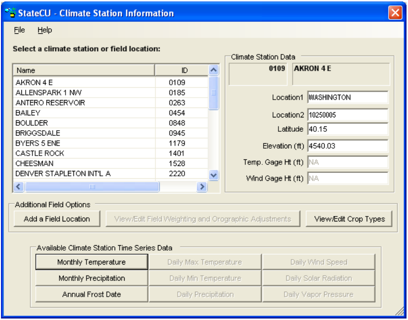
**

Figure 29 -  Climate Station Information Window with a _Climate Station_ (<a href="../figure29.PNG">see also the full-size image</a>)

**

###2.5.3.1 - View/Edit Historical Climate Data###

To view the monthly climate data, select a climate station from the list in the __Climate Station Information__
window and then click on one of the data buttons under the __Available Climate Station Time Series Data__
group. An example of the __Monthly Precipitation__ window and results displayed from the __View…Graph__
menu are provided in [Figure 30](#figure30). The other daily and monthly data windows are similar. 

The user has the ability to edit the climate data through this window. See [Section 3.5](../ModelDescription/35.md) for information on
how to edit data through the GUI. When __Save__ or __Save As…__ is selected, the user will be prompted for a
climate data file name (e.g. \*.prc, \*.tem) and associated response file name. The new crop distribution file
name is written to the response (\*.rcu) file. 

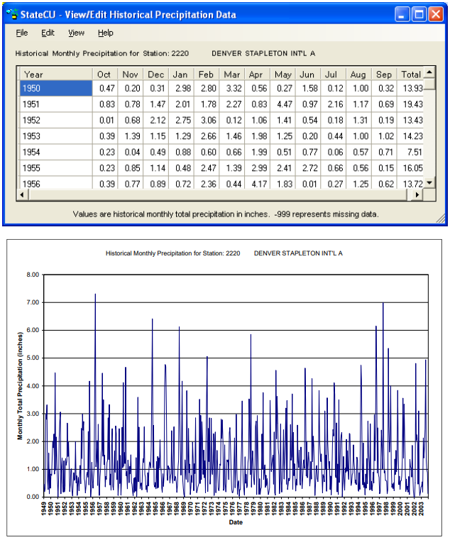
**

Figure 30 -  View/Edit Historical Climate Data (<a href="../figure30.PNG">see also the full-size image</a>)

**

###2.5.3.2 - View/Edit Crop Types###

With a _Climate Station Scenario_, the crop types are associated directly with the climate station (or field
location if one has been added) and the analysis is performed on a unit acreage basis. With a _Structure
Scenario_, the crop types are associated with the structure location and the analysis is performed for a
specified total acreage and acreages of each crop type (See [Section 2.5.4](#254-structure-information)).

To view and edit the crop information, select a climate station from the list in the __Climate Station
Information__ window and then click the __View/Edit Crop Types__ command button. The __View/Edit Crop
Acreage Data__ window provides the list of all available crop types in the crop characteristic (\*.cch) file
included in the scenario and the fraction of land associated with each crop type for each year of the analysis
period in the upper portion of the window [(Figure 31)](#figure31). The lower portion of the window sums the acreage
percentages by year and can not be explicitly edited. Editing acreage percentages in the upper portion of the
window will change the total acreage in the lower portion of the window. See [Section 2.5](../GUI/25.md) for general
information on how to edit data through the GUI. Note that for a _Climate Station Scenario_, the sum of all
crop percentages must equal 100 percent.

When __Save__ or __Save As…__ is selected, the user will be prompted for a new crop distribution (\*.cds) file name
and associated response file name. The new crop distribution file name is written to the response (\*.rcu)
file. 

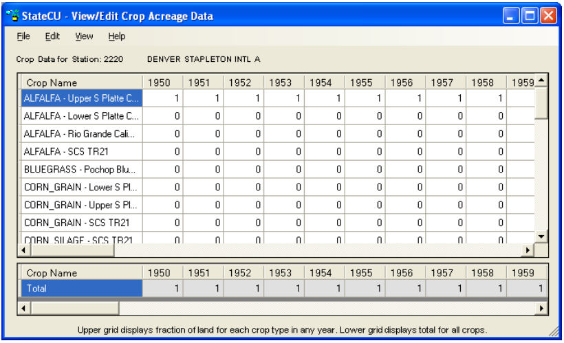
**

Figure 31 -  Crop Information Window for a _Climate Station Scenario_ (<a href="../figure31.PNG">see also the full-size image</a>)

**

###2.5.3.3 - Field Location###

Climate station data typically represent climate data at the location of a climate station. With a _Climate
Station Scenario_, a field location can be added and climate station data can be adjusted to the field location 
by specifying a latitude and elevation that are representative of the field location, assigning climate data
from an individual climate station or weighting data from up to five different climate stations, and/or
applying an orographic adjustment. Select the __Add a Field Location__ from the __Climate Station
Information__ window to input a new field location in the __Climate Station Assignment__ window [(Figure
32)](#figure32). 

* __Field ID and Field Name__ – A unique __Field ID__ and __Field Name__ must be assigned by the user. Note
that the Field ID can contain a combination of letters and numbers but no spaces. The Field ID can not
be the same as a climate station ID included in the scenario.
* __Latitude and Elevation__ – If latitude and elevation are not provided by the user, the program uses the
latitude and elevations of the climate station(s) assigned (if more than one climate station is assigned,
StateCU will calculate a latitude based on the temperature weights and the associated climate station
latitudes).
* __Climate Station ID/Name__ – If a climate station was highlighted when the __Add a Field Location__
command button was selected, then the first climate station listed in the __Climate Station Assignment__
window is the highlighted station. Climate stations can be added or changed by selecting from the
dropdown list of available stations.
* __Station Data Weighting__ – StateCU calculates the temperature and precipitation data for the field
location using the data from each climate station assigned (up to five different stations), proportioned by
the associated station weights (fractions), as described in [Section 3.1.7](../ModelDescription/31.md). With a daily analysis, a weight
(fraction) is specified for weighting the precipitation data and a temperature/other (fraction) is used to
weight all of the other climate data. The GUI provides a warning but allows the user to continue if the
weights for a given parameter (i.e. temperature data or precipitation data) do not each sum to 1.0.
* __Orographic Adjustment__ – With a monthly consumptive use analysis method (Modified BlaneyCriddle, 
Original Blaney-Criddle, or Pochop), if elevations are provided for both the field location and
the assigned climate station(s), then a temperature orographic adjustment can be used to adjust the
monthly temperature data to the field location, as described in [Section 3.1.7](../ModelDescription/31.md). This option is only
available once a field elevation is provided, and must be turned on by selecting the __On/Off__ option for
the associated climate station(s). If the user chooses to apply an orographic adjustment to precipitation
data, enter a factor that represents the average annual precipitation at the field location compared to the
average annual precipitation at the climate station. This factor is applied to monthly precipitation data.
When the orographic adjustment is initially turned ‘on’ through the StateCU GUI, the GUI displays the
default temperature adjustment of 3.6 degrees Fahrenheit per 1,000 feet and the default precipitation
adjustment of 1.0 (no adjustment). These default adjustments can be changed and saved through the
GUI. An orographic adjustment is not currently allowed for the daily ASCE Standardized PenmanMonteith method. 

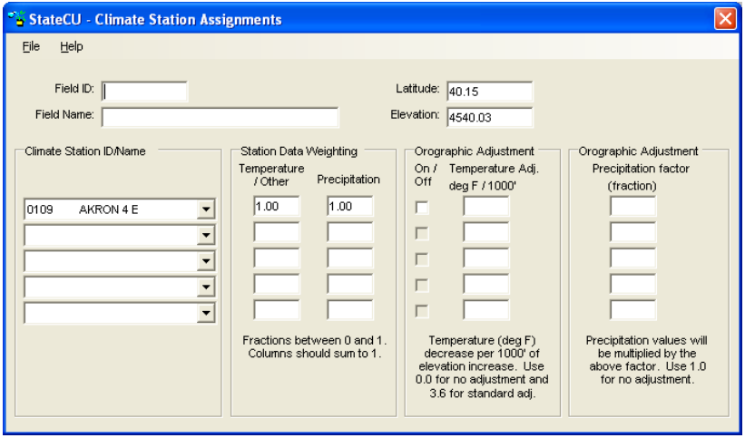
**

Figure 32 -  Climate Station Assignments Window (<a href="../figure32.PNG">see also the full-size image</a>)

**

When the __Save__ or __Save As…__ command is selected from the __Climate Station Assignments__ window, the
__Crop Information__ window is activated allowing the user to input crop and acreage information to the new
field location. Initially the GUI assigns the crop type for the new field location to the crop type associated
with the first climate station assigned. The crop information can be edited in the Crop Information window
as discussed in [Section 3.5](../ModelDescription/35.md). When the __Save__ or __Save As…__ command is selected from the __Crop Information__
window, the changes are made to the structure information (\*.str) and crop distribution (\*.cds) files and both
files are written to the response (\*.rcu) file.

Once a field location is created, it is added to the list of climate stations in the __Climate Station Information__
window, and the climate stations and station data weighting can be viewed and edited by selecting the
__View/Edit Field Weighting and Orographic Adjustment__ command button from the __Climate Station
Information__ window. The associated crop distribution information can be viewed and edited by selecting
the __View/Edit Crop Types__ command button. The proportioned climate data can not be viewed directly –
only the data associated with the climate stations used to create the field location can be viewed by selecting
the original climate station(s) from the __Climate Station Information__ window. Note that if the user does
not provide a latitude for the field location (on the __Climate Station Information__ window), the program will
calculate a weighted latitude based on the latitude of the individual climate stations and the user-specified
temperature weights. 

##2.5.4 - Structure Information##

The __Structure Information__ window [(Figure 33)](#figure33) is only available for a Structure Scenario and allows the
user to view and edit information from the input files required to define structure-specific parameters. These
files include the structure location information (\*.str) file, the parcel crop distribution (\*.cds) file, the
historic direct diversion (\*.ddh) file, the water rights (\*.ddr) file, the irrigation parameter yearly data (\*.ipy) 
file, and the ground water pumping volume data (\*.pvh) file. To revise information associated with a
structure, select the structure from the structure list. The following should be noted when editing the
structure information: 

* __Structure Information__ – The user can view and edit location identifiers (Location1, Location 2)
typically representing County and USGS Hydrologic Unit Code respectively, in addition to latitude,
elevation, and soil moisture capacity. If latitude is not provided, the program uses the latitude of the
climate station(s) assigned. If soil moisture is not entered, no soil reservoir capacity will be estimated for
the structure.
* __Climate Station Assignments__ – Climate station assignments for a structure can be viewed and edited.
* __Historical Surface Water Diversion__ – Historic surface water supply data for a structure can be viewed
and edited. Missing data is indicated by a -999 value.
* __Historical Ground Water Pumping Data__ – Historic ground water supply data for a structure can be
viewed and edited. Missing data is indicated by a -999 value.
* __Crop Acreage Data__ – Crop types and acreage for a structure can be viewed and edited.
* __Efficiency Information__ – Conveyance and irrigation efficiency information for a structure can be
viewed and edited.
* __Irrig. Method and Max Pumping Rate Data__ – Irrigation method (flood or sprinkler), water source
(surface water or ground water) information, ground water mode and monthly pumping limits for a
structure can be viewed and edited.
* __Water Rights Information__ – If a water rights analysis has been chosen, water rights associated with a
structure can be viewed (non-editable) in the __Water Rights Information__ box in the lower right corner
of the __Structure Information__ window. 

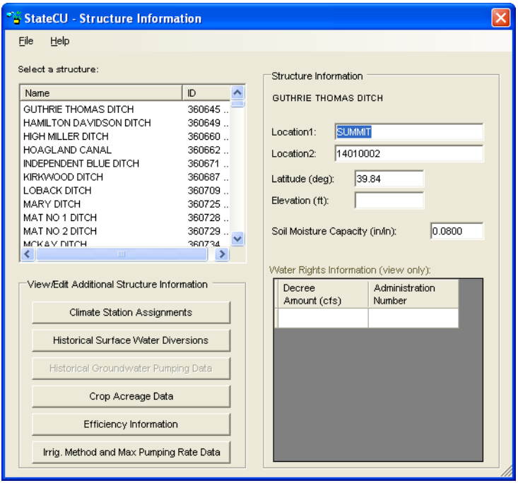
**

Figure 33 -  Structure Information Window (<a href="../figure33.PNG">see also the full-size image</a>)

**

When the __Save__ or __Save As…__ command is selected from the __Structure Information__ window, only changes
made to the location information are saved. The new structure location (\*.str) file name is written to the
response (\*.rcu) file. Changes made to any of the other structure information related windows which are
accessed from the __Structure Information__ window must be saved directly under the associated windows. 

###2.5.4.1 - Climate Station Assignments###

The __Climate Station Assignments__ window is similar to the window used to add a field location under a
Climate Station Scenario ([Section 2.5.3.3](#2533-field-location) & [Figure 32](#figure32)). It allows the user to view and modify the climate
stations and weights assigned to each structure. With a monthly consumptive use analysis, StateCU
calculates the temperature and precipitation data for a structure using the data from each selected climate
station, proportioned by the associated weights (fractions). With a daily consumptive use analysis, StateCU
calculates the maximum temperature, minimum temperature, wind speed, solar radiation, and vapor pressure
for a structure using the data from each selected climate station, proportioned by the associated
‘Temperature/Other’ weights and the precipitation is calculated using the ‘Precipitation’ weights. 

With a _Structure Scenario_ and a monthly consumptive use analysis method (Modified Blaney-Criddle,
Original Blaney-Criddle, or Pochop), the user has the option to adjust temperature and precipitation data
through orographic adjustments. If elevations are provided for both the structure and the assigned climate
station(s), then a temperature orographic adjustment can be used to adjust the monthly temperature data to a
structure, as described in [Section 3.1.7](../ModelDescription/31.md). Select __On/Off__ options for each climate station under the __Climate
Station Assignments__ window for the selected structure to turn temperature and precipitation orographic
adjustments on or off.

If the user chooses to apply an orographic adjustment to precipitation data, enter a factor that represents the
average annual precipitation at the structure compared to the average annual precipitation at the climate
station. This factor is applied to monthly precipitation data. When the orographic adjustments are initially
turned ‘on’ through the StateCU GUI, the GUI displays the default temperature adjustment of 3.6 degrees
Fahrenheit per 1,000 feet and the default precipitation adjustment of 1.0 (no adjustment). These default
adjustments can be changed and saved through the GUI. An orographic adjustment is not currently allowed
for the daily ASCE Standardized Penman-Monteith method.

When __Save__ or __Save As…__ are selected from this window, the user will be prompted for a new structure
location (\*.str) file name and the associated response file name. The new structure location file name will
be written to the response (\*.rcu) file. 

###2.5.4.2 - View Historical Surface Water Diversions###

The __View/Edit Historical Diversion Data__ window allows the user to view historic water supply data for
the selected structure under the __Structure Information__ window [(Figure 34)](#figure34). Monthly surface water supply
data is displayed for each year contained in the historical direct diversion (\*.ddh) file. The user has the
ability to edit the diversion data through this window. See [Section 2.5](../GUI/25.md) for general information on how to
edit data through the GUI.

When __Save__ or __Save As…__ are selected from this window, the user will be prompted for a new historical
direct diversion (\*.ddh) file name and the associated response file name. The new historical direct diversion
file name will be written to the response (\*.rcu) file. 

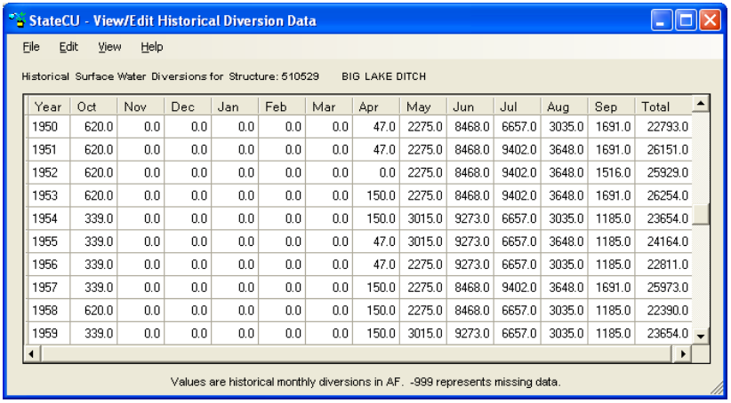
**

Figure 34 -  View/Edit Historical Diversion Data Window (<a href="../figure34.PNG">see also the full-size image</a>)

**

###2.5.4.3 - View Historical Ground Water Pumping Data###

The __View/Edit Historical Pumping Data__ window allows the user to view historic pumping data for the
selected structure under the __Structure Information__ window. Note that the user must select the Ground
Water Analysis Option in the __Model Control Options__ window to enable the __Historical Ground Water
Pumping Data__ button. Monthly pumping data is displayed for each structure contained in the ground water
pumping file (\*.pvh) file. Note that pumping data is not required for all structures listed in the structure file
(\*.str). The pumping data window is similar to the historical diversion data window, as shown in [Figure 34](#figure34),
in both display and functionality. The user has the ability to edit, copy, paste, graph and save pumping data
through the same methods as described in [Section 2.5](../GUI/25.md). 

###2.5.4.4 - View/Edit Crop Acreage Data###

The __View/Edit Crop Acreage Data__ window with a _Structure Scenario_ is similar to the window used to
view the crop types assigned to a climate station or field location with a _Climate Station Scenario_, except it
reflects actual irrigated acreage, not percentages [(Figure 35)](#figure35). With a _Structure Scenario_, the total acreage is
specified and the portion of each crop type is specified as acres. For a given year, the GUI requires the sum
of the acreage under each crop type to equal the total acreage. The __View/Edit Crop Acreage Data__ window
displays the crops for which there is acreage data at the top of the crop list in the upper portion of the
window. The lower portion of the window sums the acreage by year and can not be explicitly edited.
Editing acreage in the upper portion of the window will change the total acreage in the lower portion of the
window. Note that only crops included in the crop characteristic and crop coefficient files are shown and
can be assigned acreage. See [Section 2.5](../GUI/25.md) for general information on how to edit data through the GUI.

When the __Save__ or __Save As…__ command is selected from the __Crop Information__ window, the changes will
be made to the crop distribution (\*.cds) file and the new file name will be written to the response (\*.rcu) file.

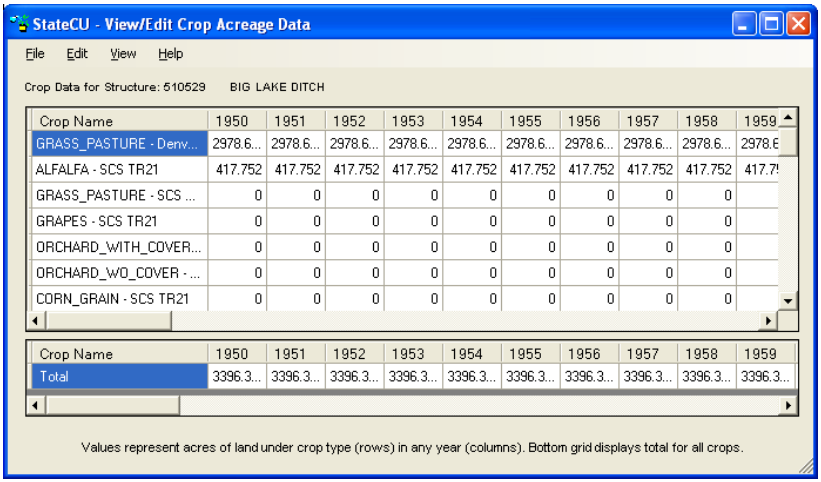
**

Figure 35 -  Crop Information Window with a _Structure Scenario_ (<a href="../figure35.PNG">see also the full-size image</a>)

**

###2.5.4.5 - View/Edit Historical Efficiency Data###

The __Water Use Efficiencies__ window [(Figure 36)](#figure36) allows the user to view and edit the annual conveyance
and maximum irrigation efficiencies for the selected structure under the __Structure Information__ window.
Enter annual canal conveyance efficiency, maximum flood irrigation application efficiency and maximum
sprinkler irrigation application efficiency parameters for each structure. The user has the ability to edit the
efficiency data through this window. See [Section 2.5](../GUI/25.md) on general information on how to edit data through the
GUI. Efficiency data must be input as a decimal (values 0 through 1 are allowable). Missing efficiency data
(-999) is not allowed in the irrigation parameter yearly data file (\*.ipy).

When __Save__ or __Save As…__ is selected, the user will be prompted for a new irrigation parameter yearly data
(\*.ipy) file name and associated response file name. The new irrigation parameter yearly file name will be
written to the response (\*.rcu) file. 

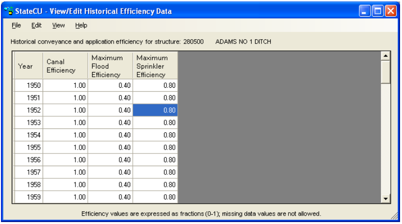
**

Figure 36 -  View/Edit Historical Efficiency Data Window (<a href="../figure36.PNG">see also the full-size image</a>)

**

###2.5.4.6 - View/Edit Irrigation Method and Maximum Pumping Rate Data###

The __View/Edit Historical Irrigation Method Data__ window [(Figure 37)](#figure37) allows the user to view and edit
annual acreage data associated with source and irrigation application method for the selected structure under
the __Structure Information__ window. 

Acreages associated with surface water-only flood irrigation, surface water-only sprinkler irrigation, surface
and ground water flood irrigation, and surface and ground water sprinkler irrigation are stored in the
irrigation parameter yearly data (\*.ipy) file. If land is only served by ground water, it should be assigned to
the surface and ground water categories. The annual acreage data by crop type are stored in the crop
distribution (\*.cds) file. For a given year, the StateCU GUI requires the sum of the acreages in all four land
use categories to equal the total irrigated acreage listed by crop type in the crop distribution (\*.cds) file. For
comparison, the GUI displays the total irrigated acreage from the crop distribution (\*.cds) file next to the
Total IPY file acreage column in this window. Any changes to the total irrigated acreage should first be
made to the crop distribution file under the __Crop Acreage Data__ window [(Section 2.5.4.4)](#2544-viewedit-crop-acreage-data). Once the revised
total irrigated acreage by crop type is saved through the __Crop Acreage Data__ window, the user can revise
the acreage listed under the four land use categories in the __View/Edit Historical Irrigation Method Data__
window. If the acreages listed in the irrigation parameter yearly file do not match the acreage stored in the
crop distribution file, StateCU will scale the \*.ipy acreages to match the \*.cds acreages during the
consumptive use analysis. The scaled data will not override the data stored in the irrigation parameter yearly
file. After running StateCU, the log file will list the number of structures that were scaled to match. The
maximum pumping rate and ground water mode can also be viewed and edited from this window. See
[Section 3.3](../ModelDescription/33.md) for information on ground water modes 1, 2 and 3. Note that data associated with ground water
supply in the \*.ipy file will only be considered in a structure scenario when the ground water supply option
has been set in the Model Control Options window (see [Section 2.5.2](#252-model-control-options)). 

The user has the ability to edit the \*.ipy acreage, pumping and ground water mode data through this
window. See [Section 2.5](../GUI/25.md) for general information on how to edit data through the GUI. The user can not
edit the Total CDS file acreage through this window; it is displayed as a comparison to the Total IPY file
acreage data. No negative acreage data can be stored in the irrigation parameter yearly file.

When __Save__ or __Save As…__ is selected, the user will be prompted for a new irrigation parameter yearly data
(\*.ipy) file name and associated response file name. The new irrigation parameter yearly data file name will
be written to the response (\*.rcu) file. 

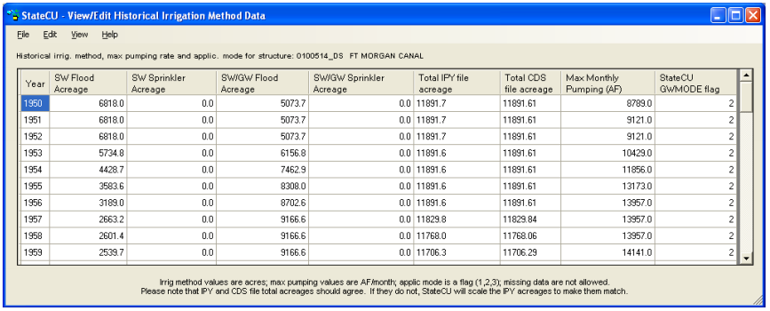
**

Figure 37 -  View/Edit Historical Irrigation Method Data (<a href="../figure37.PNG">see also the full-size image</a>)

**

##2.5.5 - Crop Characteristics/Coefficients##

The __Crop Characteristics/Coefficients__ window [(Figure 38)](#figure38) displays information contained in the crop
characteristics file (\*.cch). The user can revise the criteria that set the beginning and ending of the growing
season, other growing season constraints, maximum root zone depth, and maximum application depth for
each crop and cutting parameters for alfalfa by selecting the crop from the crop list. The beginning and
ending of the growing season specifications are compared to the other growing season constraints to
determine the actual beginning and ending of growing season applied with the model. The latest date is
used for the beginning of the growing season and the earliest date is used for the end of the growing season.
For example, if the Earliest Growing Season Start Date is specified as May 15 and the Begin Growing
Season Specification based on temperature results in a start date of April 28, the Earliest Growing Season
Start Date is used.

Individual parameters for a selected crop type can be revised by using the radio controls and entering new
information. Crop characteristics associated with a crop type that was not included in the loaded dataset can
not be created through the GUI but rather must be added to the crop characteristic file through a text editor
or StateDMI. When __Save__ or __Save As…__ is selected from this window, the user will be prompted for a new
crop characteristic file name and the associated response file name. The new crop characteristic file name
will be written to the response (*.rcu) file. 

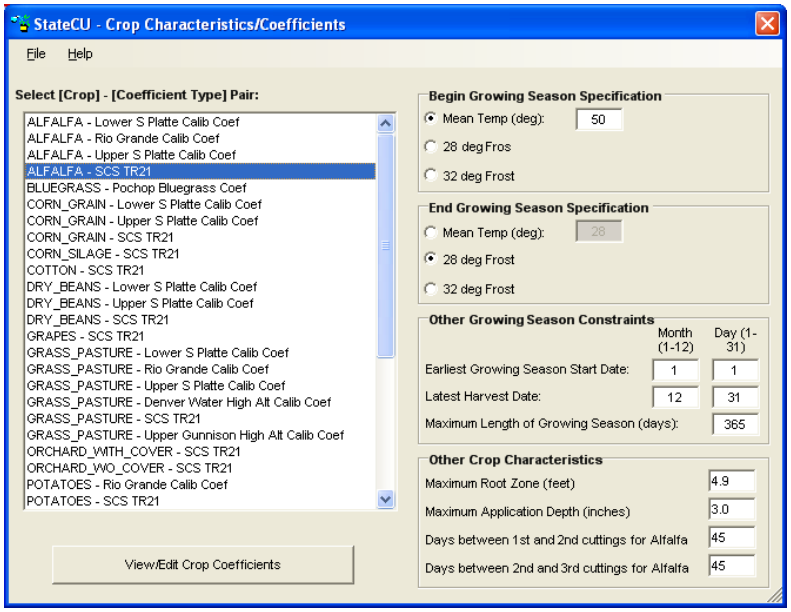
**

Figure 38 -  Crop Characteristics/Coefficients Window (<a href="../figure38.PNG">see also the full-size image</a>)

**

###2.5.5.1 - View/Edit Crop Coefficients###

The __View/Edit Crop Coefficients__ command button activates the __Crop Coefficients__ window [(Figure 39)](#figure39)
which displays the crop coefficients for the selected crop type. Crop coefficients are developed for a
particular consumptive use method (e.g. Original Blaney-Criddle, Modified Blaney-Criddle, Pochop, or
ASCE Standardized Penman-Monteith) which is specified in the crop coefficient file. The StateCU GUI
displays the ‘valid’ consumptive use methods for a selected crop type and does not allow the user to switch
between methods except to add or take away the elevation adjustment within the Modified or Original
Blaney-Criddle methods. Note that the elevation adjustment is specified for a particular crop type, as
discussed in [Section 3.1](../ModelDescription/31.md). If an elevation adjustment is specified for the `ALFALFA.TR21` crop
coefficients, then the elevation adjustment is applied to the `ALFALFA.TR21` portion of the scenario for any
climate station (under a _Climate Station Scenario_) or structure (under a _Structure Scenario_) with the crop
type of `ALFALFA.TR21` specified. Crop coefficients associated with a crop type that was not included in
the loaded dataset can not be created through the GUI, but rather must be added to the crop coefficient file
through a text editor or StateDMI.

The user has the ability to edit the crop coefficient information through this window, however can not edit
the Day of Year or the Percent of Season column. See [Section 2.5](../GUI/25.md) for general information on how to edit
data through the GUI. Note that the Add and Scale functions are disabled for this data type.

When __Save__ or __Save As…__ is selected from this window, the user will be prompted for a new crop coefficient
file name (\*.kbc) and the associated response file name. The new crop coefficient file name will be written
to the response (\*.rcu) file. 

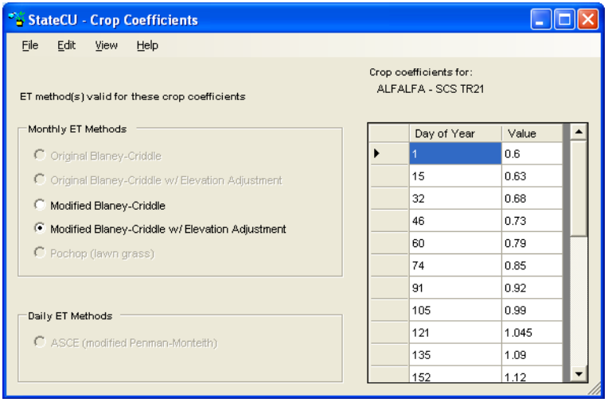
**

Figure 39 -  Crop Coefficients Window (<a href="../figure39.PNG">see also the full-size image</a>)

**

