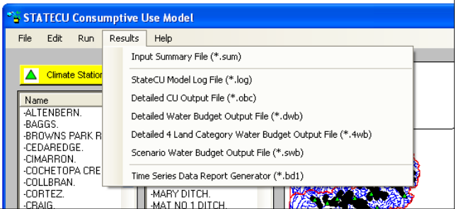
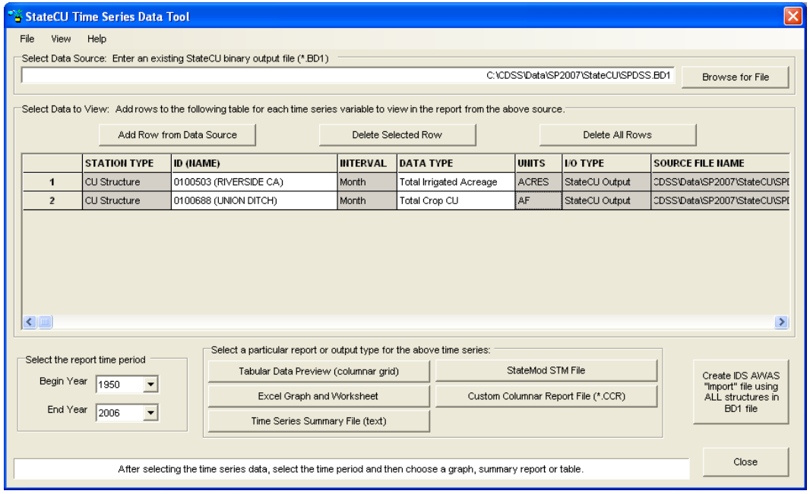
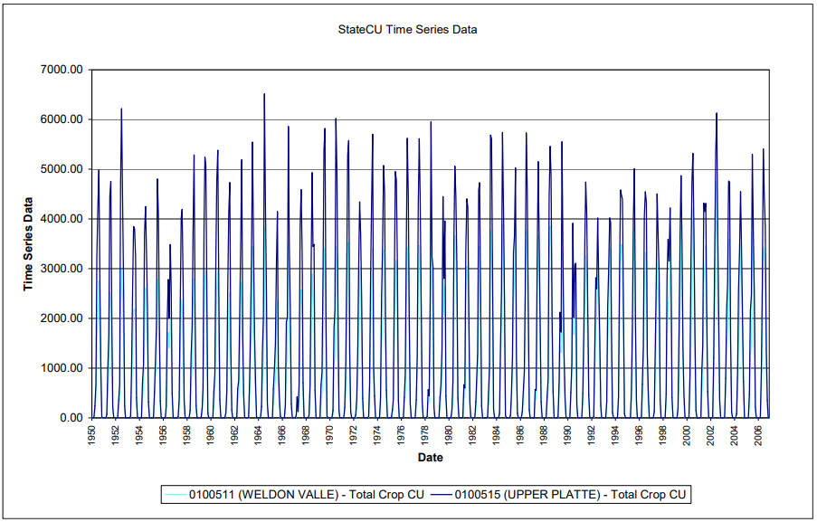
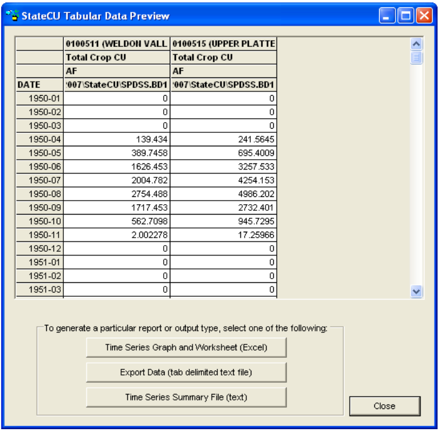
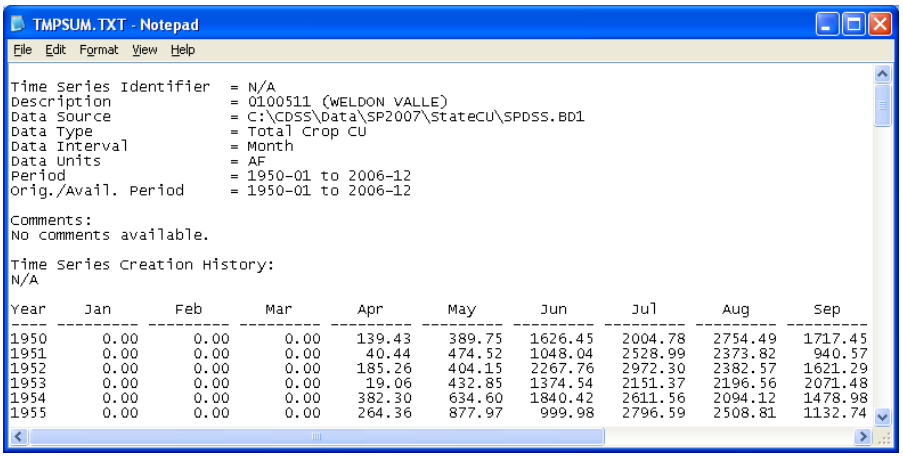
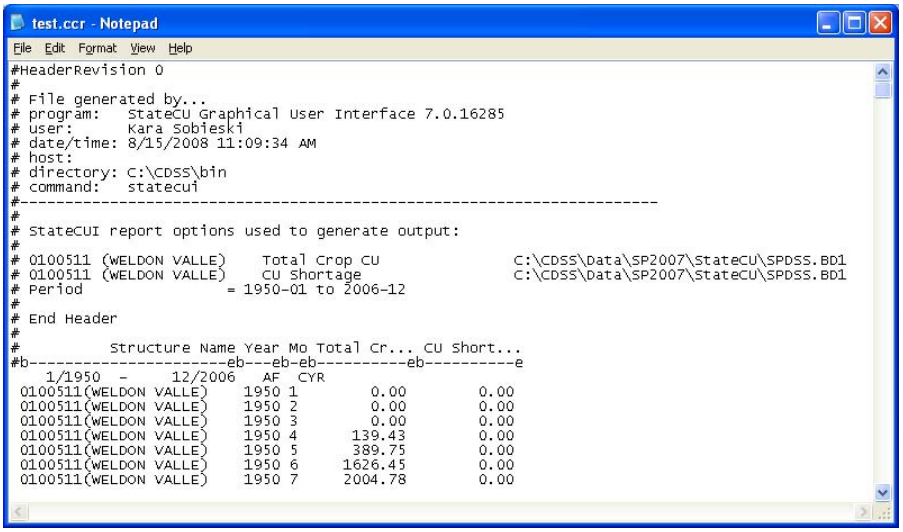
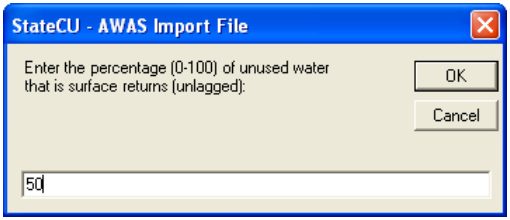
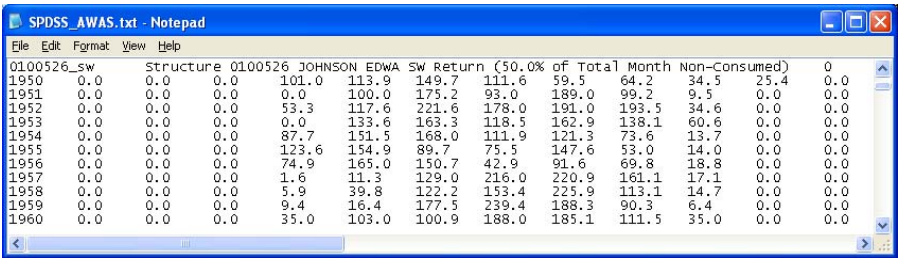

The __Results__ menu options [(Figure 40)](#figure40) allow the user to access the following output files:

* __Input Summary File__ (\*.sum)
* __StateCU Model Log File__ (\*.log)
* __Detailed CU Output File__ (\*.obc or \*.opm)
* __Detailed Water Budget Output File__ (\*.dwb)
* __Detailed 4 Land Category Water Budget Output File__ (\*.4wb) 
* __Scenario Water Budget Output File__ (\*.swb)
* __Time Series Data Report Generator__ (\*.bd1) 

Note that the Detailed CU Output File has an extension of \*.obc for the monthly consumptive use methods
(Modified Blaney-Criddle, Original Blaney-Criddle, or Pochop) and an extension of \*.opm for the daily
ASCE Standardized Penman-Monteith method. The output files available under the __Results__ menu depend
on the settings under the __More Options__ tab of the __Model Control Options__ window ([Section 2.5.2](../GUI/25.md)). The
StateCU FORTRAN model generates all the output file options, with the exception of the Report Generator,
and the GUI opens these output files using Microsoft Notepad. [Section 5](../OutputDescription/51.md) discusses the each of these
FORTRAN output options in detail. The __Time Series Data Report Generator__ is discussed below in
[Section 2.7.1](#271-time-series-data-report-generator). 

**

Figure 40 -  Results Menu Commands (<a href="../figure40.PNG">see also the full-size image</a>)

**

##2.7.1 - Time Series Data Report Generator##

When the user runs a scenario, StateCU creates a binary file (\*.bd1) with the results. The __StateCU Time
Series Data Tool__ [(Figure 41)](#figure41) allows the user to view simulation results from this binary file in graphical,
tabular, or summary formats. If the loaded scenario has been run, the __Time Series Data Tool__ displays the
binary file associated with the current scenario. The user can also search for an existing binary file through
either selecting the __Browse for File__ command button. Using this approach, results from multiple scenario
runs can be compared. 

Once a binary file is loaded, the user can view data associated with a climate station or structure by selecting
the __Add Row from Data Source__ command button. Once a row has been added, clicking on the __ID (Name)__
field will provide the user with a list of available climate stations (for a _Climate Station Scenario_) or
structures (for a _Structure Scenario_), or the user can select ‘All Structures’ stored in the binary file. The
user must select one of the climate stations or structures in the list or other summary structure options to
populate the __ID (Name)__ field. Clicking on the __Data Type__ field will provide the user with a list of available
data for the current input dataset. Again, the user must click on one of the data types in the list to populate
the __Data Type__ field. The __Begin Year__ and __End Year__ can be selected to view a subset of the available
period of record. Repeat the process discussed above to add as many rows as desired. The user can choose
to save a created list of structures and data types by selecting the __Save Current Record Set__ option under the
__File__ menu. The user can delete a series from the graph template by clicking on a row and selecting the 
__Delete Selected Row__ command button or delete all rows by selecting the __Delete All Rows__ command button.
Select the __Open Existing Record Set__ from the __File__ menu to reload a previously created template. 

The list of available data types is dependent upon the type of scenario, level of analysis and modeling
options use to create the simulation binary file, as defined in the CU control file. Options may include:
potential consumptive use, water supply limited consumptive use, surface water supply, ground water
supply, consumptive use from direct diversions, consumptive use from ground water, consumptive use from
soil reservoir, calculated surface water efficiencies, and calculated ground water efficiencies. Ground water
output options are available only for scenarios that include ground water input data. Note that some output
types and reports have restrictions on the number of structures or data types that can be included in the
report or summary.

Note that under a daily analysis (e.g. ASCE Standardized Penman-Monteith), only the monthly totals can be
viewed through the Time Series Data Tool. Daily results can be viewed from the \*.opm output file. 

**

Figure 41 -  Time Series Data Tool (<a href="../figure41.PNG">see also the full-size image</a>)

**

To create and view a graph, select the __Excel Graph and Worksheet__ command button. The __Tabular Data
Preview, Time Series Summary File__, and __StateMod STM File__ command buttons can also be selected to
view and save the data in tabular and summary formats used in the State’s other DMIs. The __Custom
Columnar Report File__ command is used to view and compare two or more columns of data generated for
one structure. Select the __Create IDS AWAS ‘Import’ File__ button to format the data from all structures
stored in the binary file into AWAS import files for use in an IDS AWAS analysis. Data stored in a binary
file can also be viewed through TSTool. To view the binary file in TSTool, open the TSTool application,
select ‘StateCUB’ as the input type, and navigate to the \*.bd1 file through the standard ‘Open File’ window.
The available binary file parameters can then be accessed, modified and viewed through TSTool. 

###2.7.1.1 - Time Series Graph and Worksheet###

The StateCU GUI uses Excel to display graphical results [(Figure 42)](#figure42) selected when the __Time Series Graph
(Excel)__ command button is selected from the __Time Series Data Tool__. The StateCU GUI opens Excel in a
separate window and the time series data are provided under a worksheet labeled __Data__. Each row specified
under the __Time Series Data Tool__ is provided in a separate column of the Excel worksheet, and labeled with
the __ID (Name), Data Type, Units__, and the binary file name and path. A single graph displaying all of the
exported data is provided under a separate worksheet labeled __Graph__. Note that units may not be consistent.
The StateCU GUI does not automatically save the results exported to Excel, however the Excel window will
prompt the user for changes before closing. If Excel is not available on the user’s computer, the __Time
Series Graph__ option is not available.

**

Figure 42 -  Time Series Data Tool Graphical Results (<a href="../figure42.PNG">see also the full-size image</a>)

**

###2.7.1.2 - Tabular Data Preview###

The StateCU GUI displays data in tabular format [(Figure 43)](#figure43) when the __Tabular Data Preview__ command
button is selected from the __Time Series Data Tool__. The StateCU GUI opens a separate window displaying
each row specified under the __Time Series Data Tool__ in a separate column labeled with the __ID (Name),
Data Type, Units__, and the binary file name and path. The tabular results can be saved to a tab-delimited
text file by selecting the __Export Data__ command button. View the tabular data using Excel by selecting the
__Time Series Graph and Worksheet__ button or view a text file of the data using Notepad by selecting the
__Times Series Summary File__ button, both located at the bottom of the __Time Series Table__ window. Data
can not be saved through the tabular preview window; however the data can be saved through each of the 
viewing and exporting options available at the bottom of the window. Select the __Close__ button to return to
the __Time Series Data Tool__ window. 

**

Figure 43 -  Time Series Table (<a href="../figure43.PNG">see also the full-size image</a>)

**

###2.7.1.3 - Time Series Summary###

The StateCU GUI uses Microsoft Notepad to display summary results [(Figure 44)](#figure44) when the __Time Series
Summary File__ button is selected from the __Time Series Data Tool__. The StateCU GUI opens Notepad in a
separate window. Each row specified under the __Time Series Data Tool__ is provided as a standard summary
report within the file, similar to that used by the State’s other DMIs. The StateCU GUI does not
automatically save the results exported to Notepad. To save results, the user must save the summary report
from Notepad before closing the Notepad window. 

**

Figure 44 -  Time Series Summary File (<a href="../figure44.PNG">see also the full-size image</a>)

**

###2.7.1.4 - StateMod STM File###

Model results can be output as a StateMod formatted file (\*.stm) by selecting the __StateMod STM File__
button from the __Time Series Data Tool__. The __StateMod STM File__ command is not used to display data,
only to format and save data in a standard format used by the State’s other DMIs. The created \*.stm file
includes comments on StateCU report options used to generate the output, the name of the structure, data
type, time period and file path name. A single StateMod output file can contain data from multiple CU
Structures, however the same Data Type must be selected for each CU Structure (e.g. create one \*.stm file
containing irrigation water requirement data and a separate \*.stm file containing total consumptive use).
The \*.stm file can be viewed through a text editor. 

###2.7.1.5 - Custom Columnar Report File###

Simulation results for a single structure can be output to a custom column report (\*.ccr) file by selecting the
__Custom Columnar Report File__ button from the __Time Series Data Tool__. This command is not used to
display data, only to format and save data in a column format to compare multiple data types for a single
structure. The created \*.ccr file includes comments on StateCU report options used to generate the output,
the name of the structure, data type(s), time period and file path name. The \*.ccr file can be viewed through
a text editor; an example \*.ccr is shown in [Figure 45](#figure45). 

**

Figure 45 -  Custom Columnar Report File (<a href="../figure45.PNG">see also the full-size image</a>)

**

###2.7.1.6 - IDS AWAS 'Import' File###

The user can export monthly pumping and non-consumed applied water estimates from the __Time Series
Data Tool__ in a format that can be imported directly to the IDS Alluvial Water Accounting System (AWAS)
program. IDS AWAS can then estimate the lagged stream depletions and accretions data based on userspecified aquifer parameters (e.g. Glover, SDF factors). The user can not specify which structures to include
with this option; all structures available in the binary file will be included in the AWAS ‘Import’ file. For
more information on the IDS AWAS program, see the Integrated Decision Support Group webpage at
www.ids.colostate.edu. The IDS AWAS ‘Import’ file creation command is currently supported by version
of IDS AWAS, Version 1.5.36. IDS personnel have indicated that future versions of IDS AWAS will
continue to support this feature. Note that non-consumed applied water does not include water lost during
conveyance to the farm.

After loading the binary file, click on the __Create IDS AWAS ‘Import’ File__ button. The GUI opens a
window in which the user can rename the AWAS ‘Import’ file and indicate the directory to save the text file
to. The GUI then opens a window asking the user to enter the percentage of unused water that is unlagged
surface return flows [(Figure 46)](#figure46). The default is zero percent; however the user can override the default with
another percentage value then click __OK__. Note that the portion of unused water that is designated as
unlagged surface return flows is assigned an SDF factor of zero, indicating immediate surface returns.
Aquifer parameters can be edited in the AWAS program. The AWAS ‘Import’ file is then created and
consists of three time series files; ground water pumping data, unlagged surface water return flow data, and
lagged ground water return flow data. These time series are ready to be imported into the IDS AWAS
program. An example of this file is shown in [Figure 47](#figure47). See [Section 7.16](../FAQ/716.md) for more information on creating
an AWAS ‘Import’ file. 

**

Figure 46 -  AWAS Import File - Surface Return Flow Percentage (<a href="../figure46.PNG">see also the full-size image</a>)

**

**

Figure 47 -  AWAS Import File (<a href="../figure47.PNG">see also the full-size image</a>)

**