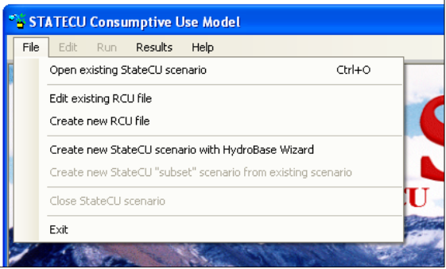
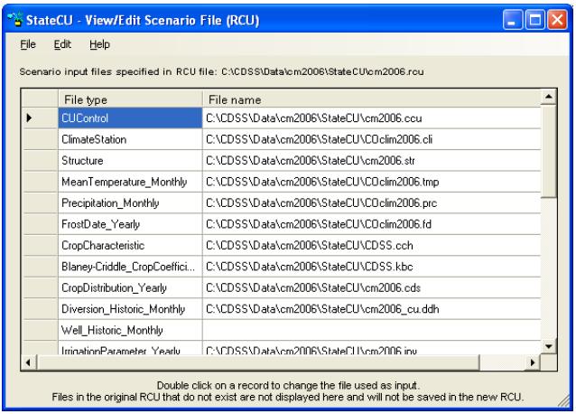
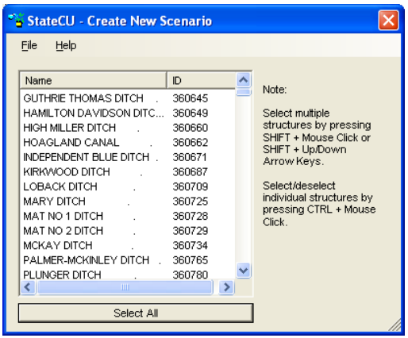

Commands under the File menu shown in [Figure 2](#figure2) below allow existing StateCU datasets to be loaded and the GUI to be
exited. 

**

Figure 2 - File Menu Commands (<a href="/../images/figure2.png">see also the full-size image</a>)

**

###2.3.1 - Open Existing StateCU Scenario###

The __Open existing StateCU scenario__ command allows the selection of a StateCU response (*.rcu) file,
which results in a dataset being read. An __Open File__ window will appear that allows the user to choose a
response file located on any available disk drive and directory. Selecting a response file triggers the GUI to
read the StateCU input files associated with that dataset.

Several base datasets are available on the CDSS website for use with the StateCU GUI corresponding to the
CDSS basin modeling efforts. Base datasets with filled climate and diversion records are provided for each
CDSS western slope basins (Gunnison, San Juan/Dolores, Upper Colorado, White and Yampa), the Rio
Grande basin and the South Platte basin. Base climate datasets with filled climate data are available for the
Arkansas and Republican basins. A statewide climate dataset is available without filling of missing climate
data.

A flag in the input control file specifies whether the CU Location is associated with a climate station or
structure. A _Climate Station Scenario_ involves a limited number of input data files, as reflected by a
simplified set of input windows displayed by the graphical user interface. The water supply limited crop
consumptive use and other more complex levels of analyses are only available under a _Structure Scenario_. 

###2.3.2 - Open Existing StateCU Scenario###

The __Edit existing RCU file__ command allows the user to edit individual input files listed in the response file
of a scenario. When the __Edit existing RCU file__ is selected from the __File menu__, an __Open File__ window is
activated that allows the user to choose a response file located on any available disk drive or directory.
Selecting a response file activates the __View/Edit Scenario File (RCU)__ window ([Figure 3](#figure3)). The user can
then double click on a file name, prompting another __Open File__ window, in which the user can choose
individual files located on any available disk drive or directory. Note that input files listed in the original
response file that do not exist are not listed in the __View/Edit Scenario File (RCU)__ window and will not be
saved in the new response file. The __Copy__ option under the __Edit__ menu allows the user to copy the input file
names and paste the list in an external application, such as a text editor or spreadsheet. Utilize the
__Edit…Select All__ option or individually select or deselect input file names to copy by holding down the
CTRL key while selecting file names with the LEFT mouse button. 

**

Figure 3 - View/Edit Scenario File (RCU) (<a href="/../images/figure3.png">see also the full-size image</a>)

**

To save the changed input files, select __Save__ from the __View/Edit Scenario File (RCU)…File__ menu. This
command saves changes over the active response file. The __Save As…__ command allows the response file to
be saved in a different location or to a different name. Select __Input File__ Info from the __Help__ menu to view
the path and filename of the active input file. 

###2.3.3 - Create New RCU File###

The __Create new RCU file__ command allows the user to create a new response file by individually selecting
input files to be listed in the new response file. When the __Create new RCU file__ is selected from the __File__
menu, a blank __View/Edit Scenario File (RCU)__ window is activated. Double click on a file name box to
activate an __Open File__ window, in which the user can choose individual input files located on any available
disk drive or directory. Enter in all of the required input files to create the new response file. Different files
are required depending on whether a _Climate Station Scenario_ or a _Structure Scenario_ is created. See
[Section 7.15](../FAQ/715.md) for more information on the required files for a _Climate Station Scenario_ and [Section 4](../Input Description/41.md) for
more information on the required input files for a _Structure Scenario_.

The __Copy__ option under the __Edit__ menu allows the user to copy the input file names and paste the list in an
external application, such as a text editor or spreadsheet. Utilize the __Edit…Select All__ option or individually
select or deselect input file names to copy by holding down the CTRL key while selecting file names with
the LEFT mouse button. To save new response file, select __Save__ or __Save As…__ from the __File__ menu. Both
commands will prompt the user to name the new response file and provide the directory location to save the
response file to. Once the new response file is saved, choose the __Open existing StateCU Scenario__ from the
__File__ menu to load the new scenario. Select __Input File Info__ from the __Help__ menu to view the path and
filename of the active input file. 

###2.3.4 - Create New StateCU Scenario Using HydroBase Wizard###
The __Create new StateCU scenario using HydroBase Wizard__ command allows the user to build a new
StateCU scenario using the HydroBase Wizard. The HydroBase Wizard is an interactive tool that guides the
user step-by-step through the development of a new scenario and pulls required input data directly from
HydroBase through an internet connection. The HydroBase Wizard can be used to create a new _Climate
Station Scenario_ or a _Structure Scenario_. See [Section 2.4](../GUI/hydrobasewizard.md) for more details on the HydroBase Wizard. 

###2.3.5 - Create New StateCU 'Subset' Scenario From Existing Scenario###
The __Create new StateCU ‘subset’ scenario from existing scenario__ command allows the user to create a
new StateCU scenario using a subset of the structures from a scenario currently loaded in the StateCU GUI.
This option is not available until a scenario has been opened and loaded in the GUI. A _Climate Station
Scenario_ can only be created from a subset of an existing _Climate Station Scenario_ and _Structure Scenario_
can only be created from a subset of an existing _Structure Scenario_.

When this command is selected from the __File__ menu, the __Create New Scenario__ window ([Figure 4](#figure4)) is
activated, in which the user can select the structures or climate stations to be included in the new scenario.
Multiple structures can be selected for inclusion in the new subset scenario by holding down the SHIFT key
while selecting structures using the LEFT mouse button or the Up and Down arrow keys. The __Select All__
button can be used to select all the structures in the currently loaded scenario. Individual structures can then
be selected or deselected by holding down the CTRL key while selecting structures using the LEFT mouse
button.

To save the desired structures in the new subset scenario, select __Save__ from the __Create New Scenario…File__
menu. This command saves changes over the active response file. The __Save As…__ command allows the
response file to be saved in a different location or to a different name. Select __Input File Info__ from the __Help__
menu to view the path and filename of the active input file. 

**

Figure 4 - Create New Scenario (<a href="/../images/figure4.png">see also the full-size image</a>)

**

###2.3.6 - Close StateCU Scenario###
The __Close StateCU Scenario__ command closes the StateCU scenario currently loaded in the StateCU GUI
without closing the StateCU GUI application. When the __Close StateCU Scenario__ command is selected
from the __File__ menu, the GUI will close the scenario and display the CDSS splashscreen. The user can then
choose to open another scenario or exit out of the GUI using options in the __File__ menu. 

###2.3.7 - Exit###
The __Exit__ command closes the StateCU GUI. When the __Exit__ command is selected from the __File__ menu, the
StateCU GUI gives the user an opportunity to choose not to exit. 