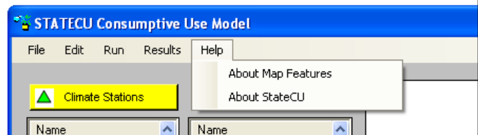

The __Help__ menu [(Figure 48)](#figure48) commands allow the user to display the software version information (__About
StateCU__) and information about the default map features (__About Map Features__). The information shown
under each of these options is only for the user’s information, no input parameters can be edited through
these commands. 

**

Figure 48 -  Help Menu Commands (<a href="/../images/figure48.png">see also the full-size image</a>)

**