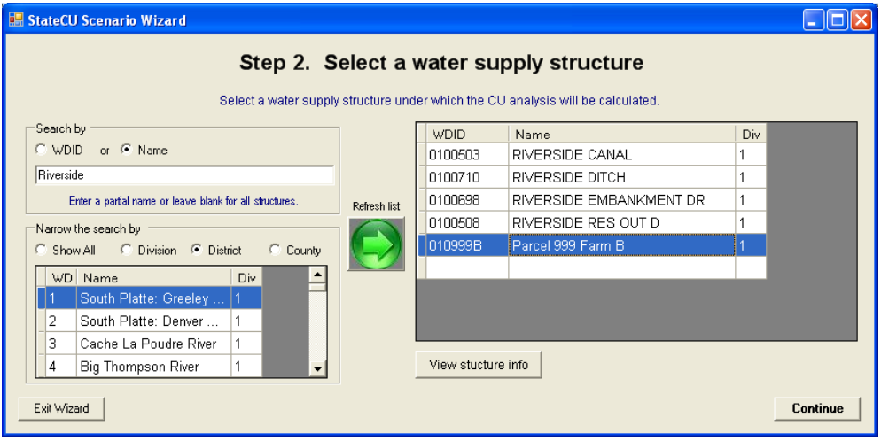

The HydroBase Wizard is an interactive tool that guides the user step-by-step through the development of a
new monthly scenario and pulls required input data directly from HydroBase through an internet connection.
The HydroBase Wizard can be used to create a new monthly _Climate Station Scenario_ or a _Structure
Scenario_. Required data (e.g. climate data, diversion records, crop characteristics) is pulled directly from
HydroBase via an active internet connection and formatted into the correct input files.

Note that the purpose of the Wizard is to create a complete and operational scenario based on HydroBase
data; it is the user’s responsibility to review and edit specific data in the input files through the GUI to
obtain accurate results. 

Activate the Wizard by selecting the __Create new StateCU scenario using HydroBase Wizard__ command
through the __File__ menu. [Figure 5](#figure5) displays the introductory screen to the Wizard. All screens in the Wizard
have an __Exit__ button. Select the __OK__ button to proceed to Step 1. 

**

Figure 5 - StateCU Scenario Wizard Welcome (<a href="figure5.PNG">see also the full-size image</a>)

**

Step 1 of the Wizard [(Figure 6)](#figure6) determines if the user would like to create a _Climate Station Scenario_ or a
_Structure Scenario_. Using the radio controls, select either the __Climate Station Scenario__ or the __Structure
Scenario__. If the __Structure Scenario__ is selected, there is the option to use crop and acreage data from the
data source and to use diversion data from the data source. If these options are checked, the crop, acreage
and diversion data loaded in HydroBase for the specific structure the user will be modeling will be used
when creating the input files. If either of these options is unchecked, the Wizard will ask for crop and
acreage data to be manually entered in Step 3 and diversion data to be manually entered by the user in the
GUI. If both options are unchecked, the user has the ability to create a new scenario based on a structure not
found in HydroBase. See [Section 2.4.2](#242-structure-scenario-creation-through-wizard) for more information on these options. 

Currently, the Wizard can only use the online DWR HydroBase via an internet connection as a source for
the data. Future development may allow the Wizard to pull data from an existing scenario or from a locally
loaded HydroBase. The message of ‘Connected’ in green text will appear if there is an active internet
connection. If one is not available, the message will state ‘Not Connected!’ in red text and traditional file
creation through the State Data Management Interfaces (DMI’s) utilizing a locally loaded HydroBase is
necessary.

Enter a new scenario name, avoiding special characters, spaces or periods in the file name. All input files
will receive the same scenario ‘base’ name. The Wizard saves all new scenarios to the
C:\CDSS\Data\StateCUWizard directory. Click on the __Continue__ button to move to the next step. 

**

Figure 6 - Step 1 of Wizard - Analysis Options (<a href="figure6.PNG">see also the full-size image</a>)

**

The following steps in the Wizard are dependent on which type of scenario is being developed. See [Section
2.4.1](#241-climate-station-scenario-creation-through-wizard) for the subsequent steps to build a Climate Station Scenario through the Wizard, and [Section 2.4.2](#242-structure-scenario-creation-through-wizard) for
the steps to build a Structure Scenario. 

###2.4.1 - Climate Station Scenario Creation through Wizard###

A _Climate Station Scenario_ created in the Wizard will determine the potential crop consumptive use and
irrigation water requirement for one or more crops at a specific climate station. Step 2 of the Wizard
[(Figure 7)](#figure7) determines which crop(s) will be used in the analysis. Crops, and their respective characteristics,
that are currently loaded in HydroBase are the only crops available for inclusion in the scenario through the
Wizard. Note that although acreage and crops can vary over time, the Wizard uses the single ‘snapshot’ of
crop and percentages input in this step and applies them to all years in the scenario. This data can be edited
in the GUI to represent changes in cropping practices.

_Climate station scenarios_ are based on a unit-acre parcel basis at a single location, therefore the percentage
of each crop on a single parcel is input in this step. Narrow the crop list by using the radio controls,
indicating a subset by crop type (e.g. alfalfa, grass pasture, corn), or a subset by crop coefficient type (e.g.
SCS TR21, Rio Grande calibrated coefficient). Refresh the available list of crops based on the subset
criteria by clicking on the green arrow in the center of the window. The resulting crop name list can be
sorted by clicking on the header label. Note the subset criteria and the resulting crop name list must include
all of the crops for inclusion into the scenario. For example, if the user wants to determine the consumptive
use for both Alfalfa.TR21 and Grass\_Pasture.DWHA, the subset criteria would be set to ‘None’ so that both
crop names would appear in the crop name list. Selected crops and percentages are lost if the crop name list
is refreshed. 

Use the check boxes to select crops to be entered in the scenario, and enter the associated percentages. The
sum of all crop percentages must equal 100 percent. To view crop characteristics for any of the listed crops,
check the box next to the crop name and then click on the __View info about selected crop__ button. This will 
activate a window listing the crop information. [Figure 8](#figure8) displays the crop characteristics for the crop
Alfalfa – SCS TR21. The user can not edit the crop information in this window; once the scenario has been
created, the user can edit this information through the GUI. The user can also choose to apply an elevation
adjustment to all TR21 Crop Coefficients, using the check box in the lower left corner of the window. The
adjustment is applied to all TR21 crops selected by the user for inclusion in the scenario. Elevation
adjustment preferences can also be edited through the GUI. Click on the __Continue__ button after entering all
the crop data to move to the next step. 

**

Figure 7 - Step 2 of Wizard - Crop Selection (<a href="figure7.PNG">see also the full-size image</a>)

**

**

Figure 8 - Crop Information (<a href="figure8.PNG">see also the full-size image</a>)

**

Step 3 of the Wizard [(Figure 9)](#figure9) determines which climate station(s) will be used in the analysis. The
_Climate Station Scenario_ will only include one consumptive use location, however data from multiple
climate stations can be used to determine the consumptive use. If multiple climate stations are selected, the 
Wizard equally weights the climate data from the multiple climate stations and uses the station ID of the
first climate station listed as the identifier appended by ‘_field’ for the consumptive use location. For
example, if Denver (ID 2220) and Greeley (ID 3546) climate stations are both selected, the Wizard would
use '2220_field', representing the station ID from Denver as the consumptive use location identifier appended
by ‘_field’, in the structure file and then include both stations in the climate station, temperature,
precipitation and frost date files. 

Climate stations, and their climate data, that are currently loaded in HydroBase are the only stations
available for inclusion in the scenario through the Wizard. The user can either search by the name of the
climate station or by the ID. To search by name, enter the name or partial name of a climate station and the
subset criteria. Narrow the name search by County, by Division or by Water District, or search all available
climate stations by indicating ‘Show All’. Click on the green arrow in the center of the window to refresh
the list. To search by climate station ID, enter the full 4 digit or partial ID and click on the green arrow. No
subset criteria are allowed when searching by ID. The resulting climate station list can be sorted by clicking
on the header label.

Note the subset criteria and the resulting climate station list must include all of the climate stations to be
included in the scenario. For example, if the user wants to determine the consumptive use using both
Greeley and Denver data, the subset criteria could be set to ‘Division’ with the ‘Name’ box left blank so that
both station names would appear in the climate station list. Selected stations are lost if the climate station
list is refreshed.

Select and highlight one or more climate stations for inclusion in the scenario. Click on the __View station
info__ button to view climate station location information. It is recommended that the user review the start
and end years, as well as the measured count of data for each climate data type to determine the extent of
available data. Click on the __View Precip Data__ and __View Temp Data__ buttons to preview the available
climate data. The user can not edit the climate data in these windows; once the scenario has been created,
the user can edit the climate data through the GUI. Note that some climate stations may have only
precipitation data or only temperature data (not both); therefore using a precipitation-only or temperature-
only climate station in a scenario would not produce analysis results. Click on the __Continue__ button after
selecting all climate stations to move to the next step.

**

Figure 9 - Step 3 of the Wizard - Climate Station Selection (<a href="figure9.PNG">see also the full-size image</a>)

**

After completing the climate station selection in Step 3 of the Wizard, the user has determined all of the
input parameters necessary to create a _Climate Station Scenario_. The Final Step of the Wizard [(Figure 10)](#figure10)
is to set the beginning and ending year of the analysis and enter a description of the scenario. The extent of
available climate data from the climate station identifier is shown in the window to help guide the user in
setting an applicable time period. Note that all time series data files will be created using these time period
parameters. Through the GUI, an analysis can be adjusted to a smaller time period, but not a larger period,
therefore it is recommended to define this period as large as available data can support. Missing data in the
input files is indicated by -999 and consumptive use calculations can not be performed for years with any
missing data. Note that options to fill missing data in this window are available only when creating
_Structure Scenario_. Edit the years by typing over the default or using the up and down arrows. 

Enter a description of the scenario in the three allotted lines, maximum of 120 characters per line. This
information is stored in the header of the model control options file (*.ccu). Select the __Create New
Scenario__ to complete the creation of the scenario. The newly created _Climate Station Scenario_ will
automatically be loaded into StateCU, whereby the user can review and edit data, and run the consumptive
use analysis.

**

Figure 10 - Final Step of the Wizard - Create New Scenario (<a href="figure10.PNG">see also the full-size image</a>)

**

Several parameters and modeling options are not specifically input by the user into the Wizard, rather it is
the responsibility of the user to review and edit these parameters through the GUI. The Wizard sets these
parameters to defaults when creating the scenario. The default settings are listed in a window [(Figure 11)](#figure11)
that is activated once the scenario is created. The following is a list of these defaults settings:

* The Modified Blaney-Criddle consumptive use analysis method is set
* The effective precipitation method is set to the SCS method.
* Crop types and crop acreages is fixed for all years 

**

Figure 11 - Climate Station Scenario Default Wizard Settings (<a href="figure11.PNG">see also the full-size image</a>)

**

###2.4.2 - Structure Scenario Creation through Wizard###

A _Structure Scenario_ created in the Wizard will determine the potential crop consumptive use, irrigation
water requirement and water supply limited consumptive use for one or more crops at a specific diversion
structure. Step 2 of the Wizard [(Figure 12)](#figure12) determines the consumptive use location that will be used in the
analysis. Diversion structures, and their respective diversion records, that are currently loaded in HydroBase
are available for inclusion in the scenario through the Wizard. The user can either search by the name of the
structure or by the ID. To search by name, enter the name or partial name of a diversion structure and the
subset criteria. Narrow the name search by County, by Division, or by Water District or ‘Show All’
available structures. Click on the green arrow in the center of the window to refresh the list. To search by
structure ID, enter the full 7-digit or partial ID and click on the green arrow. No subset criteria are allowed
when searching by ID. Note that there are numerous diversion structures loaded into HydroBase and that a
refined subset criteria is necessary. If a subset criteria option results in too numerous of diversion structures,
the Wizard will provide a message and allow the user to redefine the criteria. The resulting structure list can
be sorted by clicking on the header label. 

Select and highlight a single structure from the structure list. Click on the __View structure info__ to view
structure and diversion class information. If in Step 1, the user checked the box to use diversion data from
HydroBase for the selected structure, the user is able to select a structure and preview the total diversion
data by clicking on the __View DivTotal__. The Wizard defaults to use structure total diversions, however the
user can use the radio controls to select either total diversions or select individual diversion classes. See the
following paragraph for a discussion on using diversion classes. If in Step 1, the user unchecked the box to
use diversion data from HydroBase, the user will be unable to view or select diversion data and diversions
will be set to zero in the direct diversion data file (*.ddh). If in Step 1, the user unchecked both boxes to use
crop and diversion data from HydroBase, the Wizard allows the user to create a scenario for a new structure
or location. See [Section 2.4.2.1](#2421-create-new-non-hydrobase-structure-scenario) for a discussion on this feature.

In Step 1, the user checked the box to use diversion data from HydroBase for the selected structure, the user
can utilize diversion classes to create the direct diversion data file. After selecting the structure from the list,
select the __Select div classes__ radio control and then click the __Continue__ button. This will prompt the Wizard
to activate the Step 2A window [(Figure 13)](#figure13), in which the user can select specific diversion classes. Preview
the diversion class data by checking a diversion class from the list and clicking on the __Display diversion
time series for selected record__ button. Review the period of record and measured count of the data to
determine the extent of the data available for the diversion class. See Chapter VIII of the Water
Commissioner Handbook for information on diversion class coding. Select one or more diversion classes
and click __OK__. The selected diversion classes are summed and will over-ride the default of total diversions.
If no diversion classes are selected in Step 2A, the default of total diversions will be used. 

**

Figure 12 - Step 2 of Wizard - Diversion Structure Selection (<a href="figure12.PNG">see also the full-size image</a>)

**

**

Figure 13 - Step 2A of Wizard - Diversion Class Selection (<a href="figure13.PNG">see also the full-size image</a>)

**

Step 3 of the Wizard [(Figure 14)](#figure14) determines which crop(s) will be used in the analysis. Crops, and their
respective characteristics, that are currently loaded in HydroBase are the only crops available for inclusion
in the scenario through the Wizard. Note that although acreage and crops can vary over time, the Wizard
uses the single ‘snapshot’ of the most current CDSS acreage assessment data in this step and applies them to
all years in the scenario. This data can be edited in the GUI to represent changes in cropping practices. 

If in Step 1, the user checked the box to use crop data from HydroBase for the selected structure, the Wizard
automatically displays the most recent GIS crop information from HydroBase in the crop selection window.
The user can choose to keep the default HydroBase crop information or edit the crops or acreage as needed.
No subset options exist and the green refresh arrow is disabled if the Step 1 box is checked, however all
available crops are listed and can be used in the scenario. Note that the Wizard can only create a scenario
using TR.21 coefficients, therefore if HydroBase has a non-TR.21 crop assigned to a specific structure the
Wizard will translate these crops according to the following chart. 

| HydroBase Crop | Translated Wizard Crop |
| ------------ | ------------- |
| Corn | Corn_Grain.TR21 |
| Small Grains | Spring_Grain.TR21 |
| Sod Farm | Grass_Pasture.TR21 |
| Sunflower | Spring_Grain.TR21 |
| Wheat | Spring_Grain.TR21 |

If in Step 1 the user unchecked the box to use crop data from HydroBase, the user can narrow the list by
using the radio controls, indicating a subset by crop type (e.g. alfalfa, grass pasture, corn) or a subset by crop
coefficient type (e.g. SCS TR21, Rio Grande calibrated coefficient). Refresh the available list of crops
based on the subset criteria by clicking on the green arrow in the center of the window. The resulting crop
name list can be sorted by clicking on the header label. Note the subset criteria and the resulting crop name
list must include all of the crops for inclusion into the scenario. For example, if the user wants to determine
the consumptive use for both Alfalfa.TR21 and Grass_Pasture.DWHA, the subset criteria would be set to
‘None’ so that both crop names would appear in the crop name list. Selected crops and percentages are lost
if the crop name list is refreshed. 

Use the check boxes to select crops to be entered in the scenario, and enter the associated acreage. To view
crop characteristics for any of the listed crops, check the box next to the crop name and then click on the
__View info about selected crop__ button. This will activate a window listing the crop information. The user
can not edit the crop information in this window; once the scenario has been created, the user can edit this
information through the GUI. The user can also choose to apply an elevation adjustment to all TR21 Crop
Coefficients, using the check box in the lower left corner of the window. The adjustment is applied to all
TR21 crops selected by the user for inclusion in the scenario. Elevation adjustment preferences can also be
edited through the GUI. Click on the __Continue__ button after entering all the crop data to move to the next
step. 

**

Figure 14 - Step 3 of Wizard - Crop Selection (<a href="figure14.PNG">see also the full-size image</a>)

**

Step 4 of the Wizard [(Figure 15)](#figure15) determines which climate station(s) will be used in the analysis. The
_Structure Scenario_ will only include one consumptive use location, however data from multiple climate
stations can be used to determine the consumptive use. If multiple climate stations are selected, the Wizard
equally weights the climate data from the multiple climate stations for the analysis. 

Climate stations, and their climate data, that are currently loaded in HydroBase are the only stations
available for inclusion in the scenario through the Wizard. The user can either search by the name of the
climate station or by the ID. To search by name, enter the name or partial name of a climate station and the
subset criteria. Narrow the name search by County, by Division or by Water District, or search all available
climate stations by indicating ‘Show All’. Click on the green arrow in the center of the window to refresh
the list. To search by climate station ID, enter the full 4 digit or partial ID and click on the green arrow. No
subset criteria are allowed when searching by ID. The resulting climate station list can be sorted by clicking
on the header label.

Note the subset criteria and the resulting climate station list must include all of the climate stations to be
included in the scenario. For example, if the user wants to determine the consumptive use using both
Greeley and Denver data, the subset criteria could be set to ‘Division’ with the ‘Name’ box left blank so that
both station names would appear in the climate station list. Selected stations are lost if the climate station
list is refreshed. 

Select and highlight one or more climate stations for inclusion in the scenario. Click on the __View station
info__ button to view climate station location information. It is recommended that the user review the start
and end years, as well as the measured count of data for each climate data type to determine the extent of
available data. Click on the __View Precip Data__ and __View Temp Data__ buttons to preview the available
climate data. The user can not edit the climate data in these windows; once the scenario has been created,
the user can edit the climate data or fill missing climate data through the GUI. Note that some climate
stations may have only precipitation data or only temperature data (not both); therefore using such climate 
stations in a scenario would not produce analysis results. Click on the __Continue__ button after selecting all
climate stations to move to the next step. 

**

Figure 15 - Step 4 of Wizard - Climate Station Selection (<a href="figure15.PNG">see also the full-size image</a>)

**

After completing the climate station selection in Step 4 of the Wizard, the user has determined all of the
input parameters necessary to create a _Structure Scenario_. The Final Step of the Wizard [(Figure 16)](#figure16) is to
set the beginning and ending year of the analysis and enter a description of the scenario. Note that all time
series data files will be created using these time period parameters. Through the GUI, an analysis can be
adjusted to a smaller time period, but not a larger period, therefore it is recommended to define this period as
large as available data can support. Missing data in the input files is indicated by -999. The user can choose
to have StateCU fill missing data ‘on-the-fly’ with month averages or zeros through selecting __Missing time
series data fill options__ in the Final Step. Note that ‘on-the-fly’ filling will fill the missing data for the
consumptive use calculations only; the original input file data will remain unchanged. Consumptive use
calculations can not be performed for years with any missing data. When creating the _Structure Scenario_,
the time period defaults to the beginning and ending year of available diversion data for the diversion
structure. Edit the years by typing over the default or using the up and down arrows. 

Enter a description of the scenario in the three allotted lines, maximum of 120 characters per line. This
information is stored in the header of the model control options file (*.ccu). Select the __Create New
Scenario__ to complete the creation of the scenario. 

**

Figure 16 - Final Step of Wizard - Create New Scenario (<a href="figure16.PNG">see also the full-size image</a>)

**

Several parameters and modeling options are not specifically input by the user into the Wizard, rather it is
the responsibility of the user to review and edit these parameters through the GUI. The Wizard sets these
parameters to defaults when creating the scenario. The default settings are listed in a window [(Figure 17)](#figure17)
that is activated once the scenario is created. The following is a list of these defaults settings: 

* The Modified Blaney-Criddle consumptive use analysis method is set
* The effective precipitation method is set to the SCS method.
* Crop types and crop acreages is fixed for all years
* Canal efficiencies are set to 80%
* Acreage is all set to be flood irrigated and crop types are fixed for all years (non-variable)
	* The maximum flood irrigation efficiency is set to 45%
	* The maximum sprinkler irrigation efficiency is set to 75%
* No soil moisture accounting and structure available water capacity is set to zero 

**

Figure 17 - Structure Scenario Wizard Default Settings (<a href="figure17.PNG">see also the full-size image</a>)

**

####2.4.2.1 - Create New Non-HydroBase Structure Scenario ####
The Wizard has the ability to create an operational and complete _Structure Scenario_ for a user-specified
structure or location not using information from HydroBase. The process to create this new scenario is
similar to the process outlined in [Section 2.4.2](#242-structure-scenario-creation-through-wizard), except the user defines the structure ID. The main
differences between the two processes take place in Step 1 and Step 2, therefore this discussion will focus on
these differences. It is recommended the user thoroughly read [Section 2.4.2](#242-structure-scenario-creation-through-wizard) prior to creating a new nonHydroBase structure scenario.

In Step 1 of the Wizard [(Figure 6)](#figure6), use the radio controls to select the __Structure Scenario__ under analysis
type and uncheck both of the boxes indicating not to use crop acreage and diversion data from HydroBase.
Enter a new scenario name, avoiding special characters, spaces or periods in the file name then click on the
__Continue__ button to move to the next step.

In Step 2 of the Wizard [(Figure 18)](#figure18), there will be an empty line at the bottom of the structure list. Enter the
water district structure ID (WDID) in the first box in the bottom line. The WDID can be a maximum of 12
characters with no spaces and no periods. It is recommended that the first 2 digits of the WDID reflect the
Water District in which the structure is located. If no WDID is entered, ‘Field1’ will be used as the WDID.
Enter the Name in the second box of the bottom line (maximum of 40 characters) that briefly describes the
new structure. Enter the numeric Water Division in which the structure is located. Note that only one new
structure can be included in the scenario. By default, the direct diversion file will reflect zero diversions for
the newly created structure. Highlight the new structure line and click on the __Continue__ button to move to
the next step. The remaining steps in creating a new non-HydroBase structure scenario are the same as
outlined in [Section 2.4.2](#242-structure-scenario-creation-through-wizard). As with _Structure Scenarios_ created from HydroBase, it is the user’s
responsibility to review and edit input data through the GUI to obtain accurate results. 

**

Figure 18 - Example New Non-HydroBase Structure Scenario (<a href="figure18.PNG">see also the full-size image</a>)

**