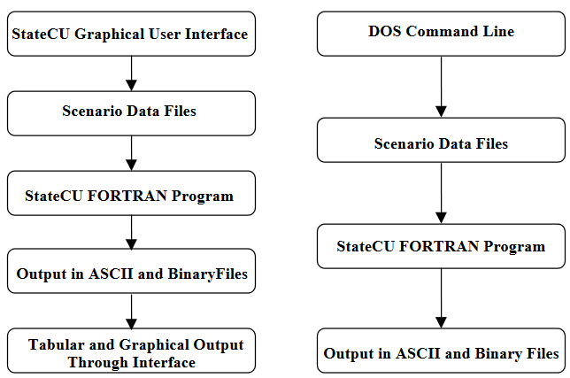

The consumptive use model can be executed through the StateCU Graphical User Interface (GUI) or 
from a DOS command line. The components are shown in [Figure 49](#figure49)

**

Figure 49 - StateCU and Graphical User Interface Components (<a href="../figure49.PNG">see also the full-size image</a>)

**

[Appendix B, Section B-1](../AppendixB/B1.md) provides flow charts showing the logical flow of the StateCU FORTRAN analyses components. 
[Appendix B, Section B-2](../AppendixB/B2.md) provides a description of the program subroutines. 